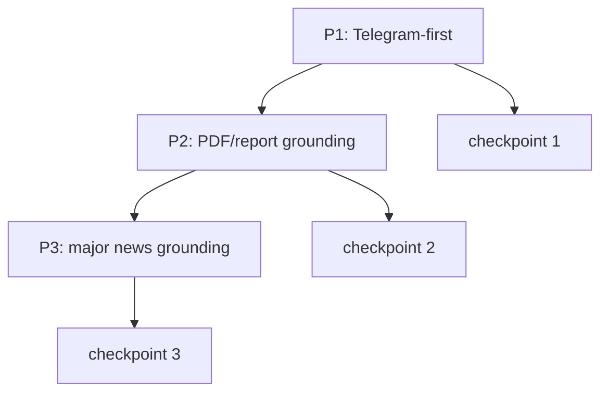

# Stock Report Engine V2 Implementation Plan

> **For agentic workers:** REQUIRED SUB-SKILL: Use superpowers:subagent-driven-development (recommended) or superpowers:executing-plans to implement this plan task-by-task. Steps use checkbox (`- [ ]`) syntax for tracking.

**Goal:** 기존 `daily_report`와 병행 운영 가능한 `Stock Report Engine V2`를 추가하고, Phase 1에서는 Telegram-only same-day report를, Phase 2에서는 Vector DB + recall + PDF grounding을, Phase 3에서는 major news grounding을 구현한다.

**Architecture:** 같은 저장소 안에 `src/pipelines/stock_report/`를 새로 두고, `jarvis report daily-v2`로 노출한다. 최종 구조는 `Postgres + 별도 Vector DB`이지만, rollout은 단계적으로 간다. Phase 1은 `Postgres + psycopg + raw SQL migration`만 사용해 당일 집계 리포트를 만들고, Phase 2부터 Vector DB를 붙여 recall과 hybrid retrieval로 확장한다. 렌더링은 `Python Markdown builder`만 사용하며 `Jinja`는 도입하지 않는다.

**Tech Stack:** Python 3.12, Typer, Pydantic v2, psycopg, OpenAI embeddings, LangChain adapters, pytest, uv, Vector DB, [opendataloader-pdf](https://github.com/opendataloader-project/opendataloader-pdf)

**설계서:** `docs/superpowers/specs/2026-05-08-stock-report-engine-v2-design.md`

---

## 파일 구조

### 새로 만드는 파일
- `src/pipelines/stock_report/__init__.py`
- `src/pipelines/stock_report/models.py`
- `src/pipelines/stock_report/config.py`
- `src/pipelines/stock_report/db.py`
- `src/pipelines/stock_report/pipeline.py`
- `src/pipelines/stock_report/taxonomy.py`
- `src/pipelines/stock_report/telegram_ingest.py`
- `src/pipelines/stock_report/normalize.py`
- `src/pipelines/stock_report/prompts.py`
- `src/pipelines/stock_report/classify.py`
- `src/pipelines/stock_report/chunking.py`
- `src/pipelines/stock_report/embed.py`
- `src/pipelines/stock_report/retrieval.py`
- `src/pipelines/stock_report/synthesize.py`
- `src/pipelines/stock_report/render_markdown.py`
- `migrations/stock_report/001_phase1.sql`
- `migrations/stock_report/002_phase2.sql`
- `migrations/stock_report/003_phase3.sql`
- `scripts/stock_report_migrate.py`
- `tests/pipelines/stock_report/test_models.py`
- `tests/pipelines/stock_report/test_normalize.py`
- `tests/pipelines/stock_report/test_classify.py`
- `tests/pipelines/stock_report/test_chunking.py`
- `tests/pipelines/stock_report/test_retrieval.py`
- `tests/pipelines/stock_report/test_render_markdown.py`
- `tests/pipelines/stock_report/test_pipeline.py`
- `config/stock_report_vocabulary.yaml`

### 수정하는 파일
- `src/cli/main.py` - `report daily-v2`, 이후 `report ingest-pdf` 추가
- `pyproject.toml` - `psycopg` 관련 의존성 추가 (Vector DB client 의존성은 Phase 2에서 추가)
- `config.yaml` - `stock_report` operational knobs 추가

## 작업 흐름

## Phase 1: Telegram-First

### T01. Fixture 날짜와 compare 기준을 고정한다

**Files:**
- Modify: `tests/pipelines/stock_report/test_pipeline.py`
- Create: `tests/pipelines/stock_report/fixtures/README.md`

**Why:** 병행 운영은 결과 비교 기준이 없으면 진행이 안 된다.

**기대효과:** V1/V2를 같은 날짜로 반복 비교할 수 있다.

- [ ] fixture 날짜 4개를 고른다: ordinary / forward-heavy / opinion-heavy / long-message-heavy
- [ ] 각 날짜의 검증 포인트를 문서화한다
- [ ] `daily`와 `daily-v2`를 같은 날짜로 실행하는 compare test contract를 적는다

### T02. `stock_report` 패키지와 CLI 진입점을 추가한다

**Files:**
- Create: `src/pipelines/stock_report/__init__.py`
- Create: `src/pipelines/stock_report/pipeline.py`
- Modify: `src/cli/main.py`

**Why:** 기존 `daily_report`를 깨지 않고 새 엔진을 병행 운영해야 한다.

**기대효과:** `jarvis report daily-v2 DATE`로 새 엔진을 독립 실행할 수 있다.

- [x] `run_daily_v2(date, data_dir, provider)` 시그니처를 고정한다
- [x] `@report_app.command("daily-v2")`를 추가한다

### T03. Phase 1 Postgres migration과 연결 계층을 만든다

**Files:**
- Create: `migrations/stock_report/001_phase1.sql`
- Create: `scripts/stock_report_migrate.py`
- Create: `src/pipelines/stock_report/db.py`
- Modify: `pyproject.toml`

**Why:** 파일 기반 구조만으로는 exact retrieval과 evidence trace를 만들 수 없다.

**기대효과:** Telegram-first knowledge base의 최소 저장소가 준비된다.

- [x] `telegram_messages`, `forward_source_map`, `knowledge_chunks`, `report_runs`, `report_evidence` 테이블을 만든다
- [x] migration runner는 순서대로 SQL 파일을 실행하고 완료 이력을 남긴다
- [x] `knowledge_chunks`에는 `embed_payload`까지만 저장하고 벡터 컬럼은 넣지 않는다
- [x] ORM은 도입하지 않고 `psycopg` + raw SQL로 시작한다

### T04. Telegram raw ingest를 만든다

**Files:**
- Create: `src/pipelines/stock_report/telegram_ingest.py`
- Test: `tests/pipelines/stock_report/test_pipeline.py`

**Why:** 이후 모든 단계는 raw message가 DB에 있다는 가정 위에서 동작한다.

**기대효과:** 기존 CSV 출력물을 새 엔진이 안정적으로 재사용할 수 있다.

- [x] 기존 Telegram CSV 포맷을 읽어 `telegram_messages`에 upsert 한다
- [x] `(channel_key, channel_message_id)` 중복 적재를 막는다
- [x] `date_kst`, `forward_from_*`, `raw_text`를 누락 없이 저장한다

### T05. normalize와 grouping 규칙을 구현한다

**Files:**
- Create: `src/pipelines/stock_report/normalize.py`
- Test: `tests/pipelines/stock_report/test_normalize.py`
- Modify: `config.yaml`

**Why:** 짧은 intraday comment, URL, media, forward를 그대로 태깅하면 recall 품질이 흔들린다.

**기대효과:** noise는 줄고, 실제 의미 단위가 chunk로 남는다.

- [x] URL/미디어/clean text 추출 규칙을 고정한다
- [x] `processing_mode`를 `full/grouped_only/skip`로 나눈다
- [x] `hana_us_stock` 류의 짧은 시황은 30분 window로 grouping 한다
- [x] simhash 또는 동등한 해시로 중복/near-duplicate 판별 키를 만든다

### T06. classify contract를 구현한다

**Files:**
- Create: `src/pipelines/stock_report/classify.py`
- Create: `src/pipelines/stock_report/taxonomy.py`
- Create: `tests/pipelines/stock_report/test_classify.py`
- Create: `config/stock_report_vocabulary.yaml`

**Why:** `category_key`, `main_theme`, `sub_themes`, `ticker_tags`, `canonical_summary`는 이후 모든 집계와 retrieval의 기준이고, canonical vocabulary가 없으면 당일 집계부터 깨진다.

**기대효과:** Telegram 메시지가 LLM 기반 report unit으로 구조화되고, canonical key로 정규화된다.

- [x] `message_type` 허용값을 `signal/opinion/data/admin`으로 고정한다
- [x] `category_key`를 1개 canonical key로 정규화한다
- [x] `main_theme`는 1개, `sub_themes`는 최대 2개로 제한한다
- [x] `config/stock_report_vocabulary.yaml`에 category/theme alias mapping을 정의한다
- [ ] `vocab_candidates` 수집/정제는 `T07` 이후 운영 루프로 분리한다
- [x] `canonical_summary` 필드 계약을 검증한다
- [x] semantic extraction은 LLM structured output으로 수행한다
- [x] forward 메시지는 현재 채널이 아니라 실질 출처 기준 메타를 우선 반영한다

### T07. chunk 생성과 embed payload write path를 만든다

**Files:**
- Create: `src/pipelines/stock_report/chunking.py`
- Create: `src/pipelines/stock_report/embed.py`
- Create: `tests/pipelines/stock_report/test_chunking.py`

**Why:** retrieval 단위가 message raw text면 너무 크고 불안정하고, category/theme/ticker canonical key가 붙은 corpus가 있어야 Phase 2 backfill도 가능하다.

**기대효과:** `knowledge_chunks`가 Telegram-first canonical corpus가 된다.

- [x] `signal`, `data` 타입은 chunk 생성 대상으로 포함한다
- [x] grouped message는 synthetic chunk 1개만 만든다
- [x] `knowledge_chunks`에 `category_key`를 포함한다
- [x] `build_embed_payload()`를 한 함수로 고정한다
- [x] Phase 1에서는 payload만 저장하고 실제 임베딩/업서트는 하지 않는다

#### T07 이후 운영 작업: 주간 taxonomy 정제 루프

- [x] 당일 리포트용 `daily runtime taxonomy overlay`를 만든다
- [x] canonical taxonomy에 매칭되지 않은 unit은 `provisional_category/provisional_theme`로 당일 집계에 반영한다
- [x] overlay 결과는 YAML에 즉시 쓰지 않고 `is_provisional=true` 메타로 추적한다
- [ ] `vocab_candidates` 테이블(또는 동등 저장소)에 정규화 실패/변환 후보를 적재한다
- [ ] 수집 시점은 classify 정규화 직후로 고정하고, `raw_value -> normalized_value`를 함께 저장한다
- [ ] 주 1회 최근 7일 기준으로 후보를 집계해 `alias 추가/신규 theme/무시` 버킷 리포트를 만든다
- [ ] 자동 반영은 하지 않고, 사람 리뷰 후 `config/stock_report_vocabulary.yaml`에 반영한다

### T08. Phase 1 same-day aggregation을 만든다

**Files:**
- Create: `src/pipelines/stock_report/retrieval.py`
- Create: `tests/pipelines/stock_report/test_retrieval.py`

**Why:** Phase 1의 목표는 recall보다 당일 구조화 결과를 안정적으로 묶는 것이다.

**기대효과:** 당일 Telegram signal만으로 일관된 `category -> theme -> ticker` 섹션을 만들 수 있다.

- [x] `source_date = report_date` 기준으로 당일 chunk만 읽는다
- [x] `category_key` 기준 category bucket 생성 규칙을 구현한다
- [x] `main_theme` 기준 theme bucket 생성 규칙을 구현한다
- [x] `category_key == unclassified`면 `provisional_category`를 display bucket으로 사용한다
- [x] `ticker_tags` 기준 focus ticker bucket 생성 규칙을 구현한다
- [x] hard cap 없이 same-day dedupe 규칙만 구현한다

### T09. synthesis A/B 실험과 Python Markdown renderer를 만든다

**Files:**
- Create: `src/pipelines/stock_report/synthesize.py`
- Create: `src/pipelines/stock_report/google_grounding.py`
- Create: `src/pipelines/stock_report/render_markdown.py`
- Create: `tests/pipelines/stock_report/test_render_markdown.py`
- Create: `tests/pipelines/stock_report/test_synthesize.py`

**Why:** Phase 1의 사용자가 체감하는 결과물은 당일 Telegram 기반 report output이다. 동시에 Google Search Grounding을 최종 synthesis 보조 경로로 실험하면, Phase 3 news corpus를 만들기 전에 외부 최신성 보강이 실제 품질 개선으로 이어지는지 검증할 수 있다.

**기대효과:** evidence trace가 있는 기본 리포트와 Google-grounded 실험 리포트를 같은 T08 bundle로 비교할 수 있다.

- [x] `T09-A` 기본 경로: synthesis 입력은 당일 `category/theme/ticker` bundle만 받게 하고 prior evidence는 받지 않게 한다
- [x] `T09-A` 기본 경로: 출력 섹션을 `Pulse / Category Summaries / Core Themes / Focus Tickers / Low Confidence`로 고정한다
- [x] `T09-B` Google 경로: 동일한 T08 bundle을 Gemini Google Search Grounding이 켜진 synthesis adapter에 넣는다
- [x] `T09-B` Google 경로: 검색 citation을 Markdown 하단에 렌더링하되, theme/ticker evidence bundle과 연결 가능한 구조로 보존한다
- [x] `T09-B` Google 경로: Google 결과는 Phase 3의 `news_items`/Vector DB corpus를 대체하지 않는 실험 경로로 표시한다
- [x] `T09-C` compare 경로: 같은 날짜에 `daily_v2_DATE.md`와 `daily_v2_DATE.google.md`를 나란히 생성한다
- [~] `T09-D` 평가 기준 → eng-review(2026-05-30)에서 **T09-I 검증 하니스**로 재설계 (아래 리팩터 섹션)
- [x] Jinja 없이 builder 메서드 기반으로 Markdown을 렌더링한다
- [x] `report_runs`, `report_evidence`를 함께 기록한다
- [x] chunk 재생성 후에도 과거 run의 evidence trace가 남도록 `report_evidence`에 chunk snapshot을 저장한다

### T09 리팩터: single-call → per-category map-reduce (eng-review 2026-05-30)

**배경:** 단일 호출 synthesis가 당일 chunk의 ~65%를 드롭(coverage 35% OpenAI / 30% Gemini, 2026-05-28 측정). eng-review에서 진짜 병목이 둘로 판명됨:
- (a) **packet 절단**: `_build_chunk_packet`이 chunk당 `supporting_facts[:3]` / `evidence_items_excerpt[:4]`만 실어 LLM 도달 전에 근거 손실
- (b) **attention 분산**: 158 chunk 단일 호출이 카테고리·사건을 드롭

메트릭 교정: "chunk 커버리지"는 틀린 잣대(다채널 중복은 병합이 정답) → **distinct 정보 보존**으로 측정한다.

**최종 아키텍처:** per-category map → reduce. 커버리지가 아니라 **정리(consolidation) 품질** 근거로 채택. (외부 AI 2개(codex, Claude)는 single-call+appendix를 권고했으나, per-category의 가치가 consolidation 품질이라는 근거로 user sovereignty override.)

**Files:**
- Modify: `synthesize.py` (map/reduce 오케스트레이터, evidence bundle 계약, 구 단일호출 경로 삭제)
- Modify: `prompts.py` (per-category/ticker/overview 프롬프트, packet 절단 캡 상향)
- Modify: `render_markdown.py` (섹션 조립 + `[chunk_id] channel#msgid` 부착)
- Modify: `pipeline.py` (T09-A/B 배선, 부분 실패 처리)
- Modify: `google_grounding.py` (reduce-only grounding)
- Create: `scripts/stock_report_eval.py` (검증 하니스)
- Create: `tests/pipelines/stock_report/fixtures/bundles/*.json` (골든셋 동결 bundle)

#### T09-E. evidence bundle 계약 (Phase 2/3 seam)
- [ ] `EvidenceItem` + `build_category_evidence(bucket)` / `build_ticker_evidence(bucket)` (Phase 1=당일 chunk만, Phase 2/3가 확장)
- [ ] 카드 dataclass: `CategorySummaryCard`, `TickerCard`, `OverviewResult` (`evidence_chunk_ids` 필수)

#### T09-F. per-category / per-ticker map 합성
- [ ] `_run_synthesis_call` 공유 헬퍼 (call + sanitize + 검증) — DRY
- [ ] `_sanitize_chunk_ids` 단일 통합 (google_grounding/synthesize 중복 제거)
- [ ] `synthesize_category`: 풀 내용 던짐(절단 해제), 다채널 중복 병합, 구체 사실(숫자·급등락·사건명) 보존
- [ ] 하이브리드: chunk < 3 → raw 결정론 카드 (LLM 카드와 동일 shape)
- [ ] map 호출 실패 → raw fallback (커버리지 유지)
- [ ] `synthesize_ticker`: top-N(=10), chunk 수 기준
- [ ] **[CRITICAL]** 카테고리별 토큰 예산 + 초과 시 서브배치 (절단 해제로 큰 카테고리 컨텍스트 초과 위험)

#### T09-G. reduce 합성 (Pulse + Core Themes)
- [ ] `synthesize_overview(category_cards, ticker_cards)` — 입력은 카드(요약), raw chunk 아님
- [ ] 카테고리 요약의 구체 사실 보존 → reduce가 cross-category 연결 (예: 유가↓ → 항공↑)
- [ ] reduce `chunk_id` = 항목별 재귀속 (union blob 금지)
- [ ] grounding(T09-B) reduce-only, 실패 → 비-grounding OpenAI → 결정론 Pulse

#### T09-H. 오케스트레이션 + 렌더
- [ ] `synthesize_tiered`: 카테고리/티커 map 동시 실행(Semaphore=8) → reduce
- [ ] bundle 1회 로드 후 메모리 전달 (카테고리별 DB 재쿼리 금지, N+1 회피)
- [ ] render: 코드가 `[chunk_id] channel#msgid` 결정론 부착, LLM/raw 동일 렌더
- [ ] 구 단일호출 경로(`synthesize_same_day_bundle`, `build_report_synthesis_user_prompt`, `_build_chunk_packet`, `_build_focus_ticker_packet`) 삭제. `_build_deterministic_artifact`는 최종 fallback 유지

#### T09-I. 검증 하니스 (구 T09-D 대체)
- [ ] coverage: report_evidence(A)/markdown 파싱(B) → 카테고리별. **분모 = deduped 합성 chunk**, raw→dedup shrink 별도 기록
- [ ] LLM-as-judge = "빠진 사건 찾기"(사람 must-have 체크리스트 대비 recall) + "헛소리 찾기"(claim → chunk 추적). holistic 점수 금지
- [ ] 골든셋 = fixture 4일(T01) 동결 bundle JSON + 사람이 원본에서 만든 must-have 체크리스트
- [ ] 투트랙: Track1 동결 bundle(CI mocked + on-demand 실제 LLM), Track2 당일 라이브(드리프트 감지, 게이트 X)
- [ ] **[CRITICAL REGRESSION]** report_evidence 무결성: 전 `chunk_id` ∈ `knowledge_chunks`
- [ ] **[★ 증명 테스트]** `synthesize_tiered` → signal 청크 있는 모든 카테고리 카드 생성, 일부 map 실패 주입해도 유지

**리뷰 결정 (잠김):**
- 랜딩: 단일 PR (`feature/stock-report-google-grounding`)
- appendix: blanket catch-all 강등/제거 (중복 재주입 방지, 메트릭으로 대체)
- NOT in scope: priority_score 차등화(P2), Vector DB/PDF/news(P2/3), per-ticker 뉴스 grounding(P3), cross-category 세부 연결(수용)
- TODO: 그날 수동 eval의 "빠진 사건" → 골든셋 must-have 승격 루프. **기존 `tuning.py` 주간 QA 리뷰 + `vocab_candidates` 패턴 재사용**(저장소는 분리, SRP)

### T10. acceptance 테스트를 만든다

**Files:**
- Modify: `tests/pipelines/stock_report/test_pipeline.py`

**Why:** Phase 1 운영 안정성은 고정 fixture 기반 acceptance로 검증해야 한다.

**기대효과:** Phase 1 종료 조건을 객관적으로 확인할 수 있다.

- [ ] fixture 날짜 기준 acceptance 테스트를 만든다

## Phase 2: Vector DB + PDF / Report Grounding

### T11. Vector DB 연동과 Telegram chunk backfill을 만든다

**Files:**
- Create: `src/pipelines/stock_report/embed.py`
- Modify: `src/pipelines/stock_report/retrieval.py`
- Modify: `migrations/stock_report/002_phase2.sql`

**Why:** recall 자체가 Phase 2 목표이므로, PDF를 넣기 전에 Telegram chunk부터 semantic search 가능해야 한다.

**기대효과:** Phase 1 corpus가 Phase 2부터 recall 대상이 된다.

- [ ] Vector DB 컬렉션/인덱스 생성 규칙을 고정한다
- [ ] Phase 1 Telegram chunk를 backfill 한다
- [ ] retrieval이 `Postgres exact + Vector DB semantic` recall로 동작하게 바꾼다

### T12. PDF 입력 경로와 CLI를 추가한다

**Files:**
- Modify: `src/cli/main.py`
- Create: `src/pipelines/stock_report/pdf_ingest.py`

**Why:** PDF 유입 경로가 명확하지 않으면 backfill과 일상 운영이 섞인다.

**기대효과:** `jarvis report ingest-pdf DATE --input-dir PATH`로 PDF 편입이 가능해진다.

- [ ] `report ingest-pdf` CLI를 추가한다
- [ ] 날짜/입력 디렉토리 계약을 고정한다

### T13. `opendataloader-pdf` wrapper를 만든다

**Files:**
- Create: `src/pipelines/stock_report/pdf_ingest.py`
- Modify: `pyproject.toml`

**Why:** 외부 파서 결과를 내부 로직 전체에 직접 퍼뜨리면 결합도가 높아진다.

**기대효과:** 파서 옵션 변경이나 교체가 wrapper 내부에서 끝난다.

- [ ] [opendataloader-pdf](https://github.com/opendataloader-project/opendataloader-pdf) 결과를 내부 `ParsedDocument` 모델로 정규화한다
- [ ] phase2에서 필요한 `markdown/json` 출력만 사용한다
- [ ] OCR/hybrid 옵션은 wrapper 인자로만 노출한다

### T14. PDF 메타데이터 추출을 만든다

**Files:**
- Create: `src/pipelines/stock_report/pdf_ingest.py`
- Modify: `migrations/stock_report/002_phase2.sql`

**Why:** retrieval ranking에 제목/날짜/증권사/티커 메타가 필요하다.

**기대효과:** PDF evidence가 retrieval에서 제대로 우선순위를 받을 수 있다.

- [ ] `documents` 테이블에 broker/title/published_date/target_ticker/category/theme 필드를 저장한다
- [ ] 메타가 불완전한 문서는 low-confidence로 표시한다

### T15. PDF chunking과 vector upsert를 만든다

**Files:**
- Create: `src/pipelines/stock_report/pdf_ingest.py`
- Modify: `migrations/stock_report/002_phase2.sql`

**Why:** 전문 단위 PDF는 검색 정밀도가 너무 낮다.

**기대효과:** PDF도 Telegram과 같은 retrieval 단위로 들어가고 semantic search 대상이 된다.

- [ ] 섹션 단위 chunk를 만든다
- [ ] `knowledge_chunks(source_type='pdf')`로 적재한다
- [ ] section path를 embed payload에 포함한다
- [ ] Vector DB에 PDF chunk를 upsert 한다

### T16. Telegram-PDF cross-linker를 만든다

**Files:**
- Modify: `src/pipelines/stock_report/retrieval.py`
- Create: `tests/pipelines/stock_report/test_retrieval.py`

**Why:** 같은 이슈가 서로 다른 소스에 흩어져 있으면 리포트 설명력이 떨어진다.

**기대효과:** Telegram short signal과 PDF long-form 근거가 하나의 theme/ticker evidence로 묶인다.

- [ ] exact tag와 vector similarity를 함께 사용해 cross-link를 만든다
- [ ] 같은 문서에서 여러 chunk가 걸리면 source 단위로 합친다

### T17. report assembler가 PDF evidence를 읽도록 확장한다

**Files:**
- Modify: `src/pipelines/stock_report/synthesize.py`
- Modify: `src/pipelines/stock_report/render_markdown.py`

**Why:** Phase 2의 실질 가치는 PDF가 synthesis에 들어가는 순간 발생한다.

**기대효과:** 리포트의 근거가 짧은 텔레그램 문장만으로 끝나지 않는다.

- [ ] evidence bundle에 PDF excerpt를 추가한다
- [ ] Markdown에서 source type별 표시 형식을 나눈다

### T18. PDF validation 세트와 파싱 실패 케이스를 정리한다

**Files:**
- Create: `tests/pipelines/stock_report/fixtures/pdf/README.md`
- Modify: `tests/pipelines/stock_report/test_pipeline.py`

**Why:** PDF는 포맷 편차가 커서 기능 구현보다 실패 패턴 관리가 먼저 중요하다.

**기대효과:** 어떤 문서가 깨지는지 재현 가능하게 남는다.

- [ ] broker별 대표 PDF fixture를 고른다
- [ ] parse failure 유형을 분류한다
- [ ] low-confidence 처리 기준을 문서화한다

## Phase 3: Major News Grounding

### T19. Phase 2 운영 문서와 compare 기준을 정리한다

**Files:**
- Modify: `docs/superpowers/specs/2026-05-08-stock-report-engine-v2-design.md`
- Modify: `docs/superpowers/plans/2026-05-08-stock-report-engine-v2.md`

**Why:** Phase 2는 기능 추가뿐 아니라 rollout 기준을 고정해야 끝난다.

**기대효과:** Vector DB + PDF 포함 결과를 언제 기본 경로로 승격할지 판단 기준이 생긴다.

- [ ] compare checklist를 추가한다
- [ ] parse success/low-confidence 비율 기준을 정의한다
- [ ] cutover 판단 규칙을 적는다

### T20. ticker/theme 주요 뉴스 적재 경로를 만든다

**Files:**
- Create: `src/pipelines/stock_report/news_ingest.py`
- Modify: `migrations/stock_report/003_phase3.sql`

**Why:** DB/Vector DB에서 주요 뉴스를 찾으려면 먼저 검색 가능한 news corpus가 있어야 한다.

**기대효과:** ticker/theme별 major news pool이 쌓인다.

- [ ] `news_items` 테이블을 추가한다
- [ ] `knowledge_chunks(source_type='news')` 적재를 추가한다
- [ ] date window와 source 메타를 저장한다

### T21. ticker/theme major news hybrid ranker를 만든다

**Files:**
- Modify: `src/pipelines/stock_report/retrieval.py`
- Create: `tests/pipelines/stock_report/test_retrieval.py`

**Why:** 주요 뉴스는 exact tag와 semantic similarity를 같이 봐야 누락이 줄어든다.

**기대효과:** 티커/테마별 top-k 주요 뉴스가 자동으로 붙는다.

- [ ] `ticker/theme + date-window` 질의 계약을 만든다
- [ ] news evidence에 별도 score boost를 추가한다
- [ ] 동일 사건 중복 뉴스는 dedupe 한다

### T22. synthesis가 주요 뉴스 근거를 반영하도록 확장한다

**Files:**
- Modify: `src/pipelines/stock_report/synthesize.py`
- Modify: `src/pipelines/stock_report/render_markdown.py`

**Why:** retrieval만 있고 출력 반영이 없으면 사용자는 개선을 체감하지 못한다.

**기대효과:** 티커/테마의 중요성이 뉴스 근거와 함께 더 직접적으로 설명된다.

- [ ] evidence bundle에 major news block을 추가한다
- [ ] theme/ticker 섹션에 "주요 뉴스 근거"를 표시한다
- [ ] 근거가 없을 때는 억지 문장을 만들지 않도록 prompt guardrail을 추가한다

## 체크포인트

### Checkpoint 1

Phase 1 완료 기준:

- `daily-v2`가 fixture 날짜에서 안정적으로 실행된다
- report evidence trace가 남는다
- V1 대비 당일 canonical aggregation 안정성이 체감된다

### Checkpoint 2

Phase 2 완료 기준:

- PDF parse/low-confidence 문서가 구분된다
- Telegram과 PDF 근거가 같이 report에 반영된다
- compare 기준이 문서화된다

### Checkpoint 3

Phase 3 완료 기준:

- ticker/theme마다 주요 뉴스 근거가 있을 때 top-k가 붙는다
- 근거가 없을 때는 생성하지 않는다
- 최종 리포트가 Telegram/PDF/News 다중 근거 구조를 갖는다

## 태스크 관리 규칙

- 에픽은 `P1`, `P2`, `P3` 3개만 사용한다
- 세부 태스크는 `T01`~`T22` 고정 번호를 유지한다
- 각 태스크 Done 정의는 `코드 + focused test + fixture diff + 문서 영향 확인`이다
- 중간 리뷰 시점은 `T10`, `T19`, `T22` 완료 직후로 제한한다

## 기본 가정

- `daily_report`는 Phase 3 검증 전까지 기존 운영 경로를 유지한다
- 최종 구조는 `Postgres + 별도 Vector DB`다
- Phase 1은 Telegram-only same-day report로 가치를 먼저 검증한다
- PDF 파서는 [opendataloader-pdf](https://github.com/opendataloader-project/opendataloader-pdf) 고정이다
- 렌더링은 `Jinja` 없이 Python 코드로 구현한다

## GSTACK REVIEW REPORT

| Review | Trigger | Why | Runs | Status | Findings |
|--------|---------|-----|------|--------|----------|
| CEO Review | `/plan-ceo-review` | Scope & strategy | 0 | — | — |
| Codex Review | `/codex review` | Independent 2nd opinion | 1 | issues_found | outside-voice: codex+claude → single-call 권고, consolidation 근거로 override |
| Eng Review | `/plan-eng-review` | Architecture & tests (required) | 1 | issues_open | 9 issues, 1 critical gap |
| Design Review | `/plan-design-review` | UI/UX gaps | 0 | — | N/A (백엔드/프롬프트) |
| DX Review | `/plan-devex-review` | Developer experience gaps | 0 | — | — |

- **CROSS-MODEL:** codex + Claude 독립 검토 둘 다 single-call+appendix 권고. user가 per-category의 consolidation 품질 근거로 override (sovereignty). codex 단독 발견: packet 절단(`prompts.py:137`)이 coverage와 독립된 진짜 병목.
- **CRITICAL GAP (1):** 절단 해제 시 큰 카테고리 × 풀 내용 → 컨텍스트 초과. 카테고리별 토큰 예산 + 서브배치로 구현 단계에서 처리 필수 (T09-F).
- **UNRESOLVED (1):** 골든셋 must-have 승격 루프를 기존 `tuning.py`/`vocab_candidates`에 어떻게 통합할지 세부 (TODO로 추적).
- **VERDICT:** ENG REVIEW 통과 (DONE_WITH_CONCERNS) — 설계 잠김. critical gap 1개는 구현 시 처리. 구현 진입 가능.
