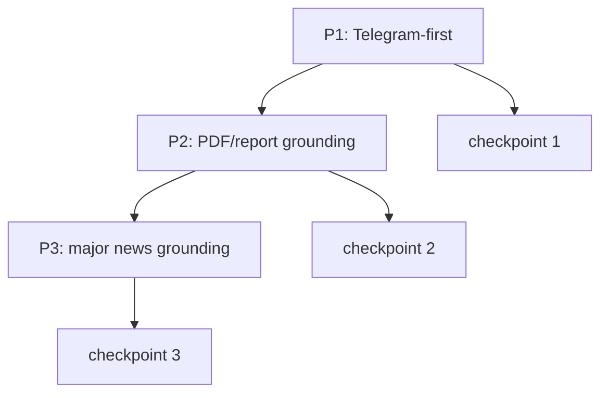

# Stock Report Engine V2 Implementation Plan

> **For agentic workers:** REQUIRED SUB-SKILL: Use superpowers:subagent-driven-development (recommended) or superpowers:executing-plans to implement this plan task-by-task. Steps use checkbox (`- [ ]`) syntax for tracking.

**Goal:** 기존 `daily_report`와 병행 운영 가능한 `Stock Report Engine V2`를 추가하고, Phase 1에서는 Telegram-only DB-backed report를, Phase 2에서는 PDF grounding을, Phase 3에서는 DB/Vector DB 기반 major news grounding을 구현한다.

**Architecture:** 같은 저장소 안에 `src/pipelines/stock_report/`를 새로 두고, `jarvis report daily-v2`로 노출한다. 저장소는 `Postgres + pgvector + psycopg + raw SQL migration` 조합으로 시작하고, retrieval은 `exact SQL + vector hybrid`로 고정한다. 렌더링은 `Python Markdown builder`만 사용하며 `Jinja`는 도입하지 않는다.

**Tech Stack:** Python 3.12, Typer, Pydantic v2, psycopg, pgvector, OpenAI embeddings, LangChain adapters, pytest, uv, [opendataloader-pdf](https://github.com/opendataloader-project/opendataloader-pdf)

**설계서:** `docs/superpowers/specs/2026-05-08-stock-report-engine-v2-design.md`

---

## 파일 구조

### 새로 만드는 파일
- `src/pipelines/stock_report/__init__.py`
- `src/pipelines/stock_report/models.py`
- `src/pipelines/stock_report/db.py`
- `src/pipelines/stock_report/pipeline.py`
- `src/pipelines/stock_report/telegram_ingest.py`
- `src/pipelines/stock_report/normalize.py`
- `src/pipelines/stock_report/classify.py`
- `src/pipelines/stock_report/chunking.py`
- `src/pipelines/stock_report/embed.py`
- `src/pipelines/stock_report/retrieval.py`
- `src/pipelines/stock_report/synthesize.py`
- `src/pipelines/stock_report/render_markdown.py`
- `src/pipelines/stock_report/compare.py`
- `migrations/stock_report/001_phase1.sql`
- `migrations/stock_report/002_phase2.sql`
- `migrations/stock_report/003_phase3.sql`
- `scripts/stock_report_migrate.py`
- `tests/pipelines/stock_report/test_models.py`
- `tests/pipelines/stock_report/test_normalize.py`
- `tests/pipelines/stock_report/test_classify.py`
- `tests/pipelines/stock_report/test_chunking.py`
- `tests/pipelines/stock_report/test_retrieval.py`
- `tests/pipelines/stock_report/test_render_markdown.py`
- `tests/pipelines/stock_report/test_pipeline.py`

### 수정하는 파일
- `src/cli/main.py` - `report daily-v2`, `report validate`, 이후 `report ingest-pdf` 추가
- `pyproject.toml` - `psycopg`, `pgvector` 관련 의존성 추가
- `config.yaml` - `stock_report` operational knobs 추가

## 작업 흐름

## Phase 1: Telegram-First

### T01. Fixture 날짜와 compare 기준을 고정한다

**Files:**
- Modify: `tests/pipelines/stock_report/test_pipeline.py`
- Create: `tests/pipelines/stock_report/fixtures/README.md`

**Why:** 병행 운영은 결과 비교 기준이 없으면 진행이 안 된다.

**기대효과:** V1/V2를 같은 날짜로 반복 비교할 수 있다.

- [ ] fixture 날짜 4개를 고른다: ordinary / forward-heavy / opinion-heavy / long-message-heavy
- [ ] 각 날짜의 검증 포인트를 문서화한다
- [ ] `daily`와 `daily-v2`를 같은 날짜로 실행하는 compare test contract를 적는다

### T02. `stock_report` 패키지와 CLI 진입점을 추가한다

**Files:**
- Create: `src/pipelines/stock_report/__init__.py`
- Create: `src/pipelines/stock_report/pipeline.py`
- Modify: `src/cli/main.py`

**Why:** 기존 `daily_report`를 깨지 않고 새 엔진을 병행 운영해야 한다.

**기대효과:** `jarvis report daily-v2 DATE`로 새 엔진을 독립 실행할 수 있다.

- [ ] `run_daily_v2(date, data_dir, provider, compare)` 시그니처를 고정한다
- [ ] `@report_app.command("daily-v2")`를 추가한다
- [ ] `@report_app.command("validate")`를 추가한다

### T03. Phase 1 DB migration과 연결 계층을 만든다

**Files:**
- Create: `migrations/stock_report/001_phase1.sql`
- Create: `scripts/stock_report_migrate.py`
- Create: `src/pipelines/stock_report/db.py`
- Modify: `pyproject.toml`

**Why:** 파일 기반 구조만으로는 retrieval과 evidence trace를 만들 수 없다.

**기대효과:** Telegram-first knowledge base의 최소 저장소가 준비된다.

- [ ] `telegram_messages`, `forward_source_map`, `knowledge_chunks`, `report_runs`, `report_evidence` 테이블을 만든다
- [ ] migration runner는 순서대로 SQL 파일을 실행하고 완료 이력을 남긴다
- [ ] ORM은 도입하지 않고 `psycopg` + raw SQL로 시작한다

### T04. Telegram raw ingest를 만든다

**Files:**
- Create: `src/pipelines/stock_report/telegram_ingest.py`
- Test: `tests/pipelines/stock_report/test_pipeline.py`

**Why:** 이후 모든 단계는 raw message가 DB에 있다는 가정 위에서 동작한다.

**기대효과:** 기존 CSV 출력물을 새 엔진이 안정적으로 재사용할 수 있다.

- [ ] 기존 Telegram CSV 포맷을 읽어 `telegram_messages`에 upsert 한다
- [ ] `(channel_key, channel_message_id)` 중복 적재를 막는다
- [ ] `date_kst`, `forward_from_*`, `raw_text`를 누락 없이 저장한다

### T05. normalize와 grouping 규칙을 구현한다

**Files:**
- Create: `src/pipelines/stock_report/normalize.py`
- Test: `tests/pipelines/stock_report/test_normalize.py`
- Modify: `config.yaml`

**Why:** 짧은 intraday comment, URL, media, forward를 그대로 태깅하면 recall 품질이 흔들린다.

**기대효과:** noise는 줄고, 실제 의미 단위가 chunk로 남는다.

- [ ] URL/미디어/clean text 추출 규칙을 고정한다
- [ ] `processing_mode`를 `full/grouped_only/skip`로 나눈다
- [ ] `hana_us_stock` 류의 짧은 시황은 30분 window로 grouping 한다
- [ ] simhash 또는 동등한 해시로 중복/near-duplicate 판별 키를 만든다

### T06. classify contract를 구현한다

**Files:**
- Create: `src/pipelines/stock_report/classify.py`
- Create: `tests/pipelines/stock_report/test_classify.py`

**Why:** `message_type`, `main_theme`, `sub_themes`, `ticker_tags`, `one_line`은 이후 모든 집계와 retrieval의 기준이다.

**기대효과:** Telegram 메시지가 리포트용 canonical signal로 정규화된다.

- [ ] `message_type` 허용값을 `signal/opinion/data/admin`으로 고정한다
- [ ] `main_theme`는 1개, `sub_themes`는 최대 2개로 제한한다
- [ ] `one_line` 30자 규칙을 검증한다
- [ ] forward 메시지는 현재 채널이 아니라 실질 출처 기준 메타를 우선 반영한다

### T07. chunk 생성과 embedding write path를 만든다

**Files:**
- Create: `src/pipelines/stock_report/chunking.py`
- Create: `src/pipelines/stock_report/embed.py`
- Create: `tests/pipelines/stock_report/test_chunking.py`

**Why:** retrieval 단위가 message raw text면 너무 크고 불안정하다.

**기대효과:** `knowledge_chunks`가 Telegram-first canonical corpus가 된다.

- [ ] `signal`, `data` 타입은 chunk 생성 대상으로 포함한다
- [ ] grouped message는 synthetic chunk 1개만 만든다
- [ ] `build_embed_text()`를 한 함수로 고정한다
- [ ] embedding model은 `text-embedding-3-small` 하나만 사용한다

### T08. SQL exact retrieval + vector retrieval을 만든다

**Files:**
- Create: `src/pipelines/stock_report/retrieval.py`
- Create: `tests/pipelines/stock_report/test_retrieval.py`

**Why:** exact tag 매칭만으로는 표현 차이를 놓치고, vector만으로는 precision이 떨어진다.

**기대효과:** high-precision + semantic recall을 동시에 확보한다.

- [ ] lookback window를 14일로 고정한다
- [ ] ticker exact / main_theme exact / sub_theme overlap 점수 규칙을 구현한다
- [ ] cosine threshold 0.68을 적용한다
- [ ] final ranker와 channel cap(채널당 최대 3개)을 구현한다

### T09. synthesis와 Python Markdown renderer를 만든다

**Files:**
- Create: `src/pipelines/stock_report/synthesize.py`
- Create: `src/pipelines/stock_report/render_markdown.py`
- Create: `tests/pipelines/stock_report/test_render_markdown.py`

**Why:** Phase 1의 사용자가 체감하는 결과물은 report output이다.

**기대효과:** evidence trace가 있는 Markdown report를 안정적으로 출력할 수 있다.

- [ ] synthesis 입력은 raw text가 아니라 evidence bundle만 받게 한다
- [ ] 출력 섹션을 `Pulse / Core Themes / Focus Tickers / Low Confidence`로 고정한다
- [ ] Jinja 없이 builder 메서드 기반으로 Markdown을 렌더링한다
- [ ] `report_runs`, `report_evidence`를 함께 기록한다

### T10. compare validator와 acceptance 테스트를 만든다

**Files:**
- Create: `src/pipelines/stock_report/compare.py`
- Modify: `tests/pipelines/stock_report/test_pipeline.py`

**Why:** 병행 운영은 실제 비교 루틴이 있어야 끝난다.

**기대효과:** Phase 1 종료 조건을 객관적으로 확인할 수 있다.

- [ ] `jarvis report validate DATE --mode compare`를 구현한다
- [ ] 같은 날짜의 V1/V2 결과를 나란히 저장하거나 출력한다
- [ ] fixture 날짜 기준 acceptance 테스트를 만든다

## Phase 2: PDF / Report Grounding

### T11. PDF 입력 경로와 CLI를 추가한다

**Files:**
- Modify: `src/cli/main.py`
- Create: `src/pipelines/stock_report/pdf_ingest.py`

**Why:** PDF 유입 경로가 명확하지 않으면 backfill과 일상 운영이 섞인다.

**기대효과:** `jarvis report ingest-pdf DATE --input-dir PATH`로 PDF 편입이 가능해진다.

- [ ] `report ingest-pdf` CLI를 추가한다
- [ ] 날짜/입력 디렉토리 계약을 고정한다

### T12. `opendataloader-pdf` wrapper를 만든다

**Files:**
- Create: `src/pipelines/stock_report/pdf_ingest.py`
- Modify: `pyproject.toml`

**Why:** 외부 파서 결과를 내부 로직 전체에 직접 퍼뜨리면 결합도가 높아진다.

**기대효과:** 파서 옵션 변경이나 교체가 wrapper 내부에서 끝난다.

- [ ] [opendataloader-pdf](https://github.com/opendataloader-project/opendataloader-pdf) 결과를 내부 `ParsedDocument` 모델로 정규화한다
- [ ] phase2에서 필요한 `markdown/json` 출력만 사용한다
- [ ] OCR/hybrid 옵션은 wrapper 인자로만 노출한다

### T13. PDF 메타데이터 추출을 만든다

**Files:**
- Create: `src/pipelines/stock_report/pdf_ingest.py`
- Modify: `migrations/stock_report/002_phase2.sql`

**Why:** retrieval ranking에 제목/날짜/증권사/티커 메타가 필요하다.

**기대효과:** PDF evidence가 retrieval에서 제대로 우선순위를 받을 수 있다.

- [ ] `documents` 테이블에 broker/title/published_date/target_ticker/category/theme 필드를 저장한다
- [ ] 메타가 불완전한 문서는 low-confidence로 표시한다

### T14. PDF chunking과 embedding 적재를 만든다

**Files:**
- Create: `src/pipelines/stock_report/pdf_ingest.py`
- Modify: `migrations/stock_report/002_phase2.sql`

**Why:** 전문 단위 PDF는 검색 정밀도가 너무 낮다.

**기대효과:** PDF도 Telegram과 같은 retrieval 단위로 들어간다.

- [ ] 섹션 단위 chunk를 만든다
- [ ] `knowledge_chunks(source_type='pdf')`로 적재한다
- [ ] section path를 embed text에 포함한다

### T15. Telegram-PDF cross-linker를 만든다

**Files:**
- Modify: `src/pipelines/stock_report/retrieval.py`
- Create: `tests/pipelines/stock_report/test_retrieval.py`

**Why:** 같은 이슈가 서로 다른 소스에 흩어져 있으면 리포트 설명력이 떨어진다.

**기대효과:** Telegram short signal과 PDF long-form 근거가 하나의 theme/ticker evidence로 묶인다.

- [ ] exact tag와 vector similarity를 함께 사용해 cross-link를 만든다
- [ ] 같은 문서에서 여러 chunk가 걸리면 source 단위로 합친다

### T16. report assembler가 PDF evidence를 읽도록 확장한다

**Files:**
- Modify: `src/pipelines/stock_report/synthesize.py`
- Modify: `src/pipelines/stock_report/render_markdown.py`

**Why:** Phase 2의 실질 가치는 PDF가 synthesis에 들어가는 순간 발생한다.

**기대효과:** 리포트의 근거가 짧은 텔레그램 문장만으로 끝나지 않는다.

- [ ] evidence bundle에 PDF excerpt를 추가한다
- [ ] Markdown에서 source type별 표시 형식을 나눈다

### T17. PDF validation 세트와 파싱 실패 케이스를 정리한다

**Files:**
- Create: `tests/pipelines/stock_report/fixtures/pdf/README.md`
- Modify: `tests/pipelines/stock_report/test_pipeline.py`

**Why:** PDF는 포맷 편차가 커서 기능 구현보다 실패 패턴 관리가 먼저 중요하다.

**기대효과:** 어떤 문서가 깨지는지 재현 가능하게 남는다.

- [ ] broker별 대표 PDF fixture를 고른다
- [ ] parse failure 유형을 분류한다
- [ ] low-confidence 처리 기준을 문서화한다

### T18. Phase 2 운영 문서와 compare 기준을 정리한다

**Files:**
- Modify: `docs/superpowers/specs/2026-05-08-stock-report-engine-v2-design.md`
- Modify: `docs/superpowers/plans/2026-05-08-stock-report-engine-v2.md`

**Why:** Phase 2는 기능 추가뿐 아니라 rollout 기준을 고정해야 끝난다.

**기대효과:** PDF 포함 결과를 언제 기본 경로로 승격할지 판단 기준이 생긴다.

- [ ] compare checklist를 추가한다
- [ ] parse success/low-confidence 비율 기준을 정의한다
- [ ] cutover 판단 규칙을 적는다

## Phase 3: Major News Grounding

### T19. ticker/theme 주요 뉴스 적재 경로를 만든다

**Files:**
- Create: `src/pipelines/stock_report/news_ingest.py`
- Modify: `migrations/stock_report/003_phase3.sql`

**Why:** DB/Vector DB에서 주요 뉴스를 찾으려면 먼저 검색 가능한 news corpus가 있어야 한다.

**기대효과:** ticker/theme별 major news pool이 쌓인다.

- [ ] `news_items` 테이블을 추가한다
- [ ] `knowledge_chunks(source_type='news')` 적재를 추가한다
- [ ] date window와 source 메타를 저장한다

### T20. ticker/theme major news hybrid ranker를 만든다

**Files:**
- Modify: `src/pipelines/stock_report/retrieval.py`
- Create: `tests/pipelines/stock_report/test_retrieval.py`

**Why:** 주요 뉴스는 exact tag와 semantic similarity를 같이 봐야 누락이 줄어든다.

**기대효과:** 티커/테마별 top-k 주요 뉴스가 자동으로 붙는다.

- [ ] `ticker/theme + date-window` 질의 계약을 만든다
- [ ] news evidence에 별도 score boost를 추가한다
- [ ] 동일 사건 중복 뉴스는 dedupe 한다

### T21. synthesis가 주요 뉴스 근거를 반영하도록 확장한다

**Files:**
- Modify: `src/pipelines/stock_report/synthesize.py`
- Modify: `src/pipelines/stock_report/render_markdown.py`

**Why:** retrieval만 있고 출력 반영이 없으면 사용자는 개선을 체감하지 못한다.

**기대효과:** 티커/테마의 중요성이 뉴스 근거와 함께 더 직접적으로 설명된다.

- [ ] evidence bundle에 major news block을 추가한다
- [ ] theme/ticker 섹션에 "주요 뉴스 근거"를 표시한다
- [ ] 근거가 없을 때는 억지 문장을 만들지 않도록 prompt guardrail을 추가한다

## 체크포인트

### Checkpoint 1

Phase 1 완료 기준:

- `daily-v2`가 fixture 날짜에서 안정적으로 실행된다
- report evidence trace가 남는다
- V1 대비 recall 가능성이 체감된다

### Checkpoint 2

Phase 2 완료 기준:

- PDF parse/low-confidence 문서가 구분된다
- Telegram과 PDF 근거가 같이 report에 반영된다
- compare 기준이 문서화된다

### Checkpoint 3

Phase 3 완료 기준:

- ticker/theme마다 주요 뉴스 근거가 있을 때 top-k가 붙는다
- 근거가 없을 때는 생성하지 않는다
- 최종 리포트가 Telegram/PDF/News 다중 근거 구조를 갖는다

## 태스크 관리 규칙

- 에픽은 `P1`, `P2`, `P3` 3개만 사용한다
- 세부 태스크는 `T01`~`T21` 고정 번호를 유지한다
- 각 태스크 Done 정의는 `코드 + focused test + fixture diff + 문서 영향 확인`이다
- 중간 리뷰 시점은 `T10`, `T18`, `T21` 완료 직후로 제한한다

## 기본 가정

- `daily_report`는 Phase 3 검증 전까지 기존 운영 경로를 유지한다
- DB는 하나만 사용하고 별도 vector DB는 도입하지 않는다
- Phase 1은 Telegram-only로 가치를 먼저 검증한다
- PDF 파서는 [opendataloader-pdf](https://github.com/opendataloader-project/opendataloader-pdf) 고정이다
- 렌더링은 `Jinja` 없이 Python 코드로 구현한다
