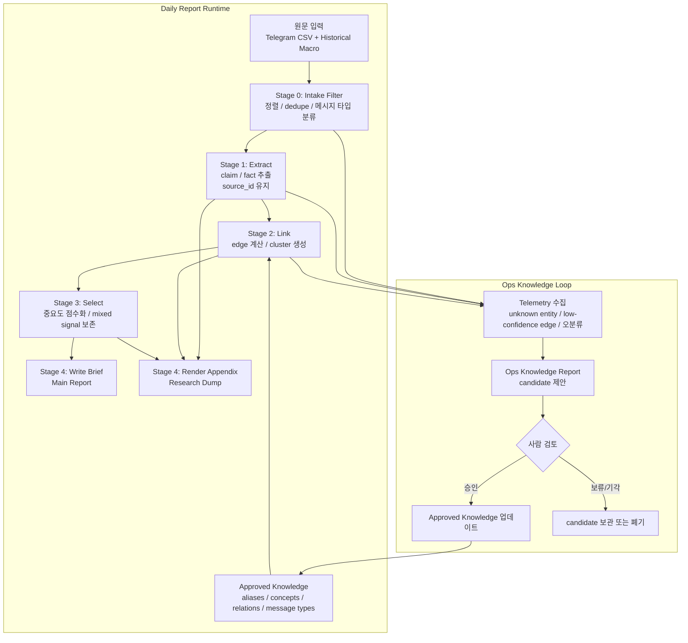

# Daily Report Runtime and Knowledge Loop Design

**작성일**: 2026-05-05  
**상태**: Draft  
**목적**: 일일 리포트 파이프라인을 재정의해 정보 유실과 왜곡을 줄이고, 출력물 분리와 knowledge 운영 루프를 통해 단계별 관찰, 재실행, 개선이 가능한 구조를 만든다.

## 관련 문서

- [2026-04-12-daily-report-design.md](./2026-04-12-daily-report-design.md)
- [2026-04-12-daily-report-v2-design.md](./2026-04-12-daily-report-v2-design.md)
- [2026-04-14-telegram-v3-information-preservation-design.md](./2026-04-14-telegram-v3-information-preservation-design.md)
- [2026-04-17-category-field-design.md](./2026-04-17-category-field-design.md)
- [2026-05-04-daily-report-remediation-design.md](./2026-05-04-daily-report-remediation-design.md)
- [map-stage-clustering-improvements.md](../../../spec/map-stage-clustering-improvements.md)

## 배경

현재 daily report 파이프라인의 핵심 문제는 모델 성능 부족보다 책임 배치 실패에 가깝다.

- 원문이 `map -> reduce -> wrapup`을 거치며 반복 재서술된다.
- 청크 간 전역 병합이 약해 같은 흐름이 여러 테마로 분절된다.
- 브로커 요약, 시장 데이터, raw intelligence가 같은 무게로 섞인다.
- 메인 리포트, 근거 탐색 문서, 시스템 개선용 운영 정보가 한 문서 또는 한 경로에 섞인다.

이 설계의 목표는 새 철학을 추가하는 것이 아니라, 기존 문서가 이미 요구한 원칙을 구현 관점에서 다시 고정하는 것이다.

- evidence-first
- code-first filtering
- LLM is for local synthesis, not global hallucinated clustering
- brief and dump separation
- observability and replayability

## 설계 목표

1. 원문과 최종 문장 사이의 추적성을 유지한다.
2. 메인 리포트는 5~10개의 핵심 narrative로 압축한다.
3. 세부 근거와 브로커 정보는 별도 탐색 산출물로 분리한다.
4. 실행 중 헷갈린 지점은 knowledge 후보로 수집하되, 런타임은 knowledge를 직접 수정하지 않는다.
5. 각 stage는 로그와 artifact를 남겨서 단독 테스트, 부분 재실행, 회귀 검증이 가능해야 한다.

## 비목표

- 초기 단계에서 범용 knowledge graph DB를 도입하지 않는다.
- 모든 업종을 한 번에 온톨로지화하지 않는다.
- 런타임 중 자동 self-learning으로 approved knowledge를 수정하지 않는다.
- 단일 프롬프트에 하루치 전체 context를 넣는 방식으로 전역 의미를 해결하지 않는다.

## 접근 대안

### 1. 보수적 개편

- 현행 5-stage를 유지하고 출력만 분리
- 장점: 가장 빠르다
- 단점: 반복 재요약 구조가 남아 근본 원인이 상당 부분 유지된다

### 2. 중간 재배선

- 외형은 유지하되 내부 책임을 `Ingest / Extract / Link / Select / Write`로 재정의
- knowledge 운영 루프와 산출물 분리를 함께 도입
- 장점: 현재 문제를 직접 겨냥하면서도 범위가 통제된다
- 단점: 모델과 stage 계약이 꽤 바뀐다

### 3. 전면 재설계

- claim graph, dedicated knowledge service, 다중 렌더러를 한 번에 재구축
- 장점: 가장 깔끔하다
- 단점: 구현 범위가 지나치게 크다

## 선택안

**선택안은 2. 중간 재배선이다.**

현재 시스템은 아키텍처를 완전히 갈아엎기보다 stage의 책임과 경계를 다시 정의하는 편이 적절하다. 이 접근은 기존 코드 구조를 활용하면서도, 정보 유실과 출력 오염의 핵심 원인을 제거한다.

## 전체 구조

## 산출물 분리

### 1. Main Report

사용자용 핵심 브리프다.

- 목적: 오늘 시장에서 읽어야 할 5~10개의 narrative를 빠르게 전달
- 독자: 최종 사용자
- 포함:
  - 날짜 고정 macro summary
  - 상위 narrative
  - 핵심 mixed signal
  - 짧은 결론
- 제외:
  - unknown entity
  - low-confidence edge
  - knowledge 후보
  - 브로커 원문 대량 나열

### 2. Research Dump

메인 리포트의 세부 근거와 탐색용 부록이다.

- 목적: 왜 이런 narrative가 나왔는지 추적
- 독자: 파워 유저, 운영자, 리서치 사용자
- 포함:
  - cluster별 claim/fact
  - source_ids
  - 원문 발췌
  - broker pulse
  - contrarian signals
  - 탈락한 세부 theme
- 제외:
  - knowledge 운영 제안
  - 시스템 내부 failure log

### 3. Ops Knowledge Report

시스템 개선용 운영 산출물이다.

- 목적: 파이프라인이 어디서 헷갈렸는지 기록하고 knowledge 업데이트 후보를 제안
- 독자: 운영자, 개발자
- 포함:
  - unknown entities
  - low-confidence edges
  - 오병합/미병합 사례
  - 새 alias/concept/relation 후보
  - 반영 우선순위
- 제외:
  - 사용자용 시장 narrative
  - 장문 시장 해설

## Stage 재정의

### Stage 0. Intake Filter

**책임**

- 날짜 기준 원문 CSV 로드
- 글로벌 timestamp 정렬
- 중복 메시지 제거
- 메시지 타입 분류
- macro data를 historical close 기준으로 고정 로드

**입력**

- `date`
- raw CSV files
- macro providers

**출력**

- `IngestedMessage[]`
- `MacroSnapshot`

**주요 필드**

- `source_id`
- `channel_id`
- `message_id`
- `timestamp`
- `raw_text`
- `message_type`
- `source_file`

**설계 원칙**

- `0.0` 같은 센티널은 허용하지 않는다
- macro 누락은 `None` 또는 명시적 missing 상태로 유지한다
- 원문 텍스트는 이후 stage에서 재로드하지 않도록 source store에서 1회 적재한다

### Stage 1. Extract

**책임**

- 원문을 `claim/fact` 카드로 구조화
- source 추적성 유지
- opinion, broker view, market data를 분리

**입력**

- `IngestedMessage[]`

**출력**

- `Claim[]`
- `Fact[]`

**예시 필드**

- `claim_id`
- `claim_type`
- `category`
- `canonical_entities`
- `target_scope`
- `polarity`
- `source_ids`
- `fact_ids`
- `confidence`

**설계 원칙**

- 이 stage의 목표는 “좋은 문장 쓰기”가 아니라 “손실 적은 구조화”다
- 숫자, 목표가, 등급, 지표는 `Fact`로 분리한다
- `summary` 중심 문자열 구조를 primary output으로 삼지 않는다

### Stage 2. Link

**책임**

- approved knowledge를 읽어 claim 간 edge 계산
- cluster 생성
- 상충 신호를 같은 cluster 안에서 유지

**입력**

- `Claim[]`
- approved knowledge

**출력**

- `ClaimEdge[]`
- `ClaimCluster[]`

**edge 계산 신호**

- category 일치
- canonical entity overlap
- parent concept overlap
- approved relation adjacency
- source diversity
- polarity conflict

**설계 원칙**

- “전역 context를 한 프롬프트에 넣는 방식”을 쓰지 않는다
- 코드는 먼저 candidate edge를 계산하고, 애매한 구간만 LLM 보조를 쓴다
- `broker_view` 단독으로 상위 cluster를 만들지 않는다

### Stage 3. Select

**책임**

- 중요도 점수화
- top narratives 선정
- mixed signal 보존
- brief 대상과 appendix-only 대상을 분리

**입력**

- `ClaimCluster[]`
- `MacroSnapshot`

**출력**

- `SelectedCluster[]`
- `ContrarianSignal[]`

**점수 요소**

- 독립 source 수
- market data 포함 여부
- cross-category 연결성
- novelty
- contradiction 존재 여부
- broker-only penalty

**설계 원칙**

- “많이 모인 것”과 “정말 중요한 것”을 구분한다
- mixed signal은 제거하지 않고 별도 유지한다

### Stage 4. Write

**책임**

- 선택된 cluster를 사람 읽는 산출물로 변환
- `Main Report`와 `Research Dump`를 분리 렌더링

**입력**

- `SelectedCluster[]`
- `ClaimCluster[]`
- `Claim[]`
- `Fact[]`
- `MacroSnapshot`

**출력**

- `MainReport`
- `ResearchDump`

**설계 원칙**

- 메인 브리프는 상위 N개만 노출한다
- appendix는 근거와 탐색성을 보존한다
- 같은 데이터를 브리프와 appendix에서 다르게 보여주되, 서로 추적 가능해야 한다

### Stage 5. Ops Review

**책임**

- 런타임 중 누적된 telemetry 정리
- knowledge 후보 제안
- 운영자 검토용 보고서 생성

**입력**

- runtime telemetry
- stage artifacts

**출력**

- `OpsKnowledgeReport`
- `KnowledgeCandidate[]`

**설계 원칙**

- 런타임은 knowledge를 쓰기만 하고 수정하지 않는다
- knowledge 후보는 approved knowledge와 분리 저장한다

## Knowledge 운영 모델

### 저장 위치

- `knowledge/`
  - 승인된 기준만 저장
  - 런타임 read-only
- `knowledge_candidates/` 또는 `ops/knowledge/`
  - 자동 수집된 후보
  - 승인 전 실험 영역

### knowledge에 넣는 것

- alias
- entity to concept mapping
- concept relation
- message type rule

### knowledge에 넣지 않는 것

- 하루짜리 뉴스
- 개별 날짜의 주장
- 단발성 브로커 내러티브
- 런타임 cluster 결과

### 새 지식의 도출 방식

새 지식은 주로 아래에서 도출한다.

- unknown entity 반복 등장
- low-confidence edge 누적
- 오병합/미병합 사례
- 사람이 읽었을 때 명백한 재사용 패턴
- 동일 오류가 여러 날짜에서 반복 재현됨

### 운영 루프

1. 런타임이 candidate를 수집한다
2. `Ops Knowledge Report`를 생성한다
3. 사람이 승인/기각/보류한다
4. 승인된 후보만 approved knowledge에 반영한다
5. 회귀 테스트 후 다음 런타임에 반영한다

## Logging과 Artifact 설계

이 설계의 핵심 요구사항 중 하나는 “충분한 로그”와 “부분 재실행 가능성”이다.

### 런타임 로그 원칙

- 모든 stage는 시작/종료/처리량/실패율을 남긴다
- claim 수, cluster 수, selected count, contradiction count를 구조화 로그로 남긴다
- failure는 fail-open으로 조용히 숨기지 않는다
- partial failure가 있으면 최종 산출물과 운영 리포트에 누락 범위를 기록한다

### stage별 필수 로그 예시

- `Ingest`
  - message_count
  - unique_channel_count
  - deduped_count
  - missing_macro_fields
- `Extract`
  - claim_count
  - fact_count
  - claim_type_distribution
  - invalid_parse_count
- `Link`
  - edge_count
  - low_confidence_edge_count
  - cluster_count
  - contradiction_cluster_count
- `Select`
  - selected_cluster_count
  - appendix_only_count
  - broker_penalized_count
- `Write`
  - main_narrative_count
  - appendix_cluster_count
  - unresolved_reference_count
- `Ops Review`
  - unknown_entity_count
  - candidate_count
  - candidate_priority_distribution

### Artifact 저장

각 stage는 재현 가능한 artifact를 저장한다. 이 artifact는 git이 아니라 로컬 실행 산출물 또는 테스트 fixture로 활용한다.

권장 경로:

- `artifacts/daily_report/<date>/<run_id>/ingest.json`
- `artifacts/daily_report/<date>/<run_id>/extract.json`
- `artifacts/daily_report/<date>/<run_id>/link.json`
- `artifacts/daily_report/<date>/<run_id>/select.json`
- `artifacts/daily_report/<date>/<run_id>/main_report.md`
- `artifacts/daily_report/<date>/<run_id>/research_dump.md`
- `artifacts/daily_report/<date>/<run_id>/ops_knowledge_report.md`

테스트 fixture는 별도로 유지한다.

- `tests/pipelines/daily_report/fixtures/stage_outputs/`

### 재실행 전략

- 특정 stage artifact가 있으면 다음 stage부터 재실행 가능해야 한다
- 같은 입력 artifact를 주면 결과가 최대한 결정론적으로 재현되어야 한다
- 프롬프트 변경 실험은 동일 artifact를 기반으로 비교 가능해야 한다

## 테스트 전략

테스트는 “함수 단위”보다 “stage 계약과 관찰 가능성”을 중심에 둔다.

### 1. 모델/스키마 테스트

- `Claim`, `Fact`, `ClaimCluster`, `OpsKnowledgeReport` 검증
- nullable macro semantics 검증
- approved knowledge schema 검증

### 2. Stage 단위 테스트

- `Ingest`: 날짜 기준 macro, dedupe, message typing
- `Extract`: claim type 분리, fact extraction, source traceability
- `Link`: edge 생성, cluster merge, contradiction preservation
- `Select`: top-k 제한, broker penalty, mixed signal 보존
- `Write`: brief/dump 분리, reference linkage
- `Ops Review`: candidate report 생성

### 3. Replay 테스트

기존 fixture와 stage artifact를 이용해 다음을 검증한다.

- 같은 입력에서 headline 수가 안정적인가
- selected cluster 수가 목표 범위에 들어오는가
- known bug가 재발하지 않는가

### 4. 리포트 품질 회귀 테스트

- 메인 브리프 narrative 수가 5~10개 이내
- `0.0` 센티널 미노출
- broker summary가 메인 톤을 장악하지 않음
- 상충 신호가 있는 날짜에 최소 1개 이상 contrarian signal 존재

### 5. 운영 루프 테스트

- unknown entity가 candidate로 수집되는가
- low-confidence edge가 ops report에 노출되는가
- 승인된 knowledge 반영 후 이전 오병합/미병합 사례가 줄어드는가

## 오류 처리 원칙

- stage 실패는 숨기지 않는다
- 부분 성공 시 누락 범위를 명시한다
- critical failure와 degraded output을 구분한다
- 메인 리포트 생성에 실패해도, 가능한 경우 `Ops Knowledge Report`는 남긴다

## 적용 순서

### P0. 기반 공사

1. macro date and missing semantics 수정
2. `IngestedMessage` 메타데이터 확장
3. `Claim`/`Fact` 스키마 추가
4. stage artifact 저장 및 structured logging 추가

### P1. linking and output split

1. `Link` stage 도입
2. `Select` stage 도입
3. `Main Report`와 `Research Dump` 분리
4. `Ops Knowledge Report` 초안 생성

### P2. 운영 강화

1. knowledge candidate 승인 흐름 정립
2. replay test suite 강화
3. domain-specific relation coverage 확장

## 성공 기준

- 메인 브리프는 5~10개 narrative로 제한된다
- 리포트와 appendix, ops report가 명확히 분리된다
- 각 stage는 artifact와 structured logs를 남긴다
- 특정 날짜의 실행 결과를 stage별로 재생할 수 있다
- approved knowledge는 런타임 중 수정되지 않는다
- knowledge 후보는 사후 검토를 거친 뒤에만 반영된다

## 구현 전 확인사항

- 기존 `models.py` 계약이 크게 바뀌므로 마이그레이션 계획이 필요하다
- 현행 `format_report()`는 단일 문서 렌더링에 묶여 있으므로 분리 렌더러가 필요하다
- 기존 stage fixture 기반 테스트는 새 stage 이름과 artifact 구조에 맞춰 재구성해야 한다

## 요약

이 설계는 daily report를 “하나의 긴 문서 생성기”에서 “원문 보존형 분석 파이프라인”으로 재정의한다. 핵심은 새 기능을 많이 더하는 것이 아니라, 다음 세 가지를 분리하는 것이다.

- 사용자용 결과물
- 탐색용 근거 덤프
- 시스템 개선용 운영 정보

그리고 이 분리를 가능하게 하는 기반은 `claim/fact extraction`, `approved knowledge read-only`, `stage artifact + replay`, `ops feedback loop`이다.
