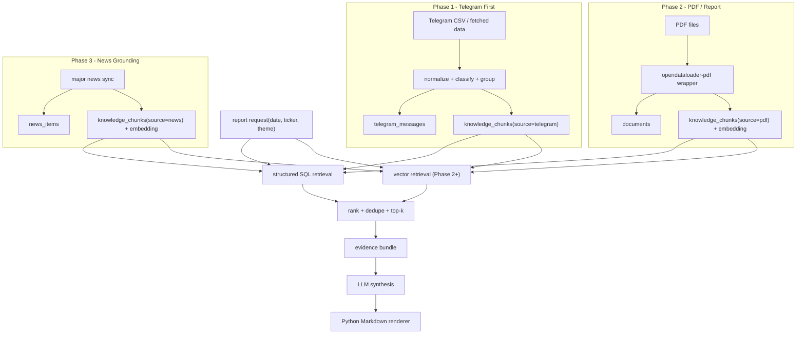
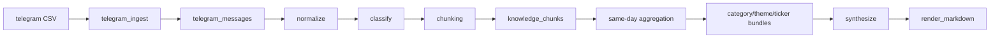

# Design: Stock Report Engine V2

**작성일**: 2026-05-08  
**상태**: APPROVED  
**대상**: `jarvis report daily-v2`  
**관련 구현 계획**: `docs/superpowers/plans/2026-05-08-stock-report-engine-v2.md`

## Problem Statement

현재 `daily_report`는 CSV/파일 기반 5단계 파이프라인으로 동작하며, 당일 텔레그램 메시지를 요약하는 데는 유효하지만
아래 요구를 만족시키기에는 구조가 맞지 않는다.

- 과거 텔레그램 시그널을 안정적으로 recall해 근거를 보강하고 싶다.
- 텔레그램과 증권사 PDF를 같은 지식 저장소 위에서 함께 다루고 싶다.
- 이후에는 티커/테마별 주요 뉴스까지 붙여 근거를 강화하고 싶다.
- 기존 `daily_report`는 유지한 채 새 엔진을 병행 운영하고 싶다.
- 템플릿 엔진(`Jinja`) 없이 Python 코드 기반으로 출력하고 싶다.

즉, 이번 작업은 기존 `daily_report`의 소규모 개선이 아니라, **같은 저장소 안에서 돌아가는 새 리포트 엔진**
`Stock Report Engine V2`를 정의하는 작업이다.

## Key Decisions

### 1. 점진적 개선이 아니라, 같은 저장소 안의 새 엔진으로 간다

- 기존 `src/pipelines/daily_report/`는 유지한다.
- 새 엔진은 `src/pipelines/stock_report/`에 만든다.
- CLI는 `jarvis report daily`와 별도로 `jarvis report daily-v2`를 추가한다.

이렇게 하면 기존 운영 경로를 깨지 않고 `V1 vs V2`를 날짜 기준으로 비교할 수 있다.

### 2. 최종 구조는 `Postgres + 별도 Vector DB`다

- Postgres는 원본/정제 데이터, 구조화 메타데이터, 리포트 실행 이력과 evidence trace를 저장한다.
- Vector DB는 `knowledge_chunks`의 semantic index와 vector retrieval만 담당한다.
- 다만 rollout은 단계적으로 간다. **Phase 1은 Postgres only**, **Phase 2부터 Vector DB를 붙인다.**

즉 최종 아키텍처는 분리형이지만, 초기 rollout은 과하지 않게 시작한다.

### 3. `DB v1/v2` 대신 `Schema Phase 1/2/3`라는 용어를 쓴다

- `Schema Phase 1`: Telegram-first schema
- `Schema Phase 2`: PDF/report schema 추가
- `Schema Phase 3`: major news grounding schema 추가

물리적인 DB는 하나고, 단계별로 필요한 테이블만 늘린다.

### 4. 리포트 렌더링은 Python Markdown builder로 고정한다

- `Jinja`는 사용하지 않는다.
- 문자열 템플릿 조합이 아니라, section 단위 메서드를 가진 builder 클래스로 렌더링한다.

이 방식이 초기 디버깅과 구조 변경에 더 안전하다.

### 5. 구현 범위는 3단계로 자른다

1. **Phase 1**: Telegram-only, Postgres-backed, same-day report
2. **Phase 2**: Vector DB 도입 + recall 시작 + PDF/report ingest
3. **Phase 3**: ticker/theme major news grounding

## Overall Architecture



## Phase Split

### Phase 1

목표는 **Telegram 메시지를 Postgres-backed knowledge base로 전환해, 먼저 당일 리포트를 안정적으로 만드는 것**이다.

- 입력: Telegram CSV / 기존 fetch 결과
- 저장: Postgres
- recall: 없음
- 출력: Markdown report
- 운영: 기존 `daily_report`와 병행

### Phase 2

목표는 **Vector DB를 도입하고, recall을 시작한 뒤 텔레그램의 짧은 시그널을 PDF 리포트로 보강할 수 있게 하는 것**이다.

- PDF 파싱은 [opendataloader-pdf](https://github.com/opendataloader-project/opendataloader-pdf)를 사용한다.
- Phase 1에서 쌓인 Telegram chunk를 먼저 Vector DB로 backfill한다.
- PDF는 `documents` + `knowledge_chunks(source_type='pdf')`로 들어간다.
- OCR나 레이아웃 보정은 라이브러리 옵션 안에서만 조정하고, 별도 문서 파이프라인은 만들지 않는다.

### Phase 3

목표는 **DB/Vector DB에서 ticker/theme 관련 주요 뉴스를 검색해 synthesis 근거를 더하는 것**이다.

- 실시간 웹 검색 엔진을 바로 붙이지 않는다.
- 먼저 내부 corpus(`news_items`, `knowledge_chunks(source_type='news')`)를 만들고 거기서 검색한다.

## Phase 1 Detailed Design

### Phase 1 Goal

`daily-v2`의 첫 번째 완성 기준은 아래와 같다.

- Telegram 메시지를 구조화해서 DB에 넣는다.
- `category_key`, `main_theme`, `sub_themes`를 canonical vocabulary 기준으로 관리한다.
- `message_type`, `main_theme`, `sub_themes`, `ticker_tags`, `canonical_summary`를 안정적으로 만든다.
- 당일 Telegram signal만으로 `category -> theme -> ticker` 묶음을 만든다.
- Jinja 없이 Markdown report를 생성한다.
- 기존 `daily_report`와 같은 날짜로 compare 가능한 수준까지 만든다.

### Phase 1 Non-Goals

아래는 Phase 1 범위에서 제외한다.

- PDF parsing / OCR
- target price consensus engine
- channel별 similarity threshold matrix
- decay taxonomy
- 영어 본문을 한국어로 사전요약 후 임베딩하는 별도 번역 파이프라인
- 외부 major news를 실시간 호출해 붙이는 기능

### Phase 1 Module Layout

```text
src/pipelines/stock_report/
  __init__.py
  pipeline.py                # run_daily_v2(date, data_dir, provider, compare)
  models.py                  # typed contracts for normalized message, chunk, evidence, report
  config.py                  # stock_report LLM settings
  db.py                      # psycopg connection helpers, SQL execution
  taxonomy.py                # category/main_theme/sub_theme registry + alias resolution
  telegram_ingest.py         # CSV load -> telegram_messages upsert
  normalize.py               # clean text, url/media extraction, simhash/grouping keys
  prompts.py                 # semantic extraction prompt templates
  classify.py                # LLM semantic extraction + taxonomy normalization + report unit flattening
  chunking.py                # raw/grouped message -> knowledge_chunks
  embed.py                   # Phase 2+: embed payload + vector sync
  retrieval.py               # Phase 2+: hybrid retrieval
  synthesize.py              # LLM prompt assembly + response parsing
  render_markdown.py         # Python Markdown builder (no Jinja)
  compare.py                 # V1/V2 compare helpers

scripts/
  stock_report_migrate.py    # runs SQL migrations in order

migrations/stock_report/
  001_phase1.sql
  002_phase2.sql
  003_phase3.sql

config/
  stock_report_vocabulary.yaml  # category/main_theme/sub_theme canonical registry
```

### Phase 1 Data Flow



### Phase 1 Processing Rules

#### 1. Raw message는 항상 보존한다

- 원본 Telegram row는 `telegram_messages`에 그대로 저장한다.
- 정제/태깅/그룹핑 결과는 별도 컬럼 또는 별도 chunk 테이블에 쌓는다.
- 재분류/재임베딩 시 원본을 다시 읽을 수 있어야 한다.

#### 2. 짧은 intraday comment는 raw 저장 후 group 단위로 chunk화한다

실제 검증 결과상 `hana_us_stock` 짧은 시황 코멘트와 일부 forward-heavy 채널은 개별 메시지 단위보다
**30분 이내 연속 묶음**이 더 의미 있다.

- raw 메시지는 모두 저장
- 100자 미만 + 같은 채널 + 30분 이내 연속 메시지는 group 후보
- group은 synthetic chunk 1개로 생성
- 개별 short message는 `grouped_only`로 남기고, 기본 retrieval 대상에서는 제외

#### 3. `message_type`은 집계/검색 제어용 필수 필드다

허용값은 아래 4개로 고정한다.

- `signal`: 직접 투자 판단에 쓰는 정보
- `opinion`: 감상, 추정, 해석 중심
- `data`: 숫자/표/수급 나열 중심
- `admin`: 공지, 운영 메시지

기본 정책:

- `signal`, `data`: chunk 생성 + embed payload 생성
- `opinion`: 저장은 하되 기본 report retrieval에서는 후순위
- `admin`: 저장만 하고 chunk/embed payload 생성 안 함

#### 4. `main_theme`는 1개, `sub_themes`는 최대 2개다

- `main_theme`는 집계 기준이 되는 단일 값
- `sub_themes`는 cross-reference용
- 카운팅은 `main_theme`로만 한다
- `sub_themes`는 테마 섹션의 "관련 테마"에만 반영한다

#### 5. `category/main_theme/sub_themes`는 registry 기준으로 관리한다

Phase 1에는 가벼운 taxonomy 관리가 반드시 들어간다. 이건 UI나 자동 병합 엔진이 아니라,
**canonical key를 유지하기 위한 registry + alias mapping** 수준이면 충분하다.

- `category_key`는 1개만 선택한다
- `main_theme`는 반드시 `category_key` 아래 canonical theme 중 1개로 정규화한다
- `sub_themes`는 최대 2개까지 허용하고, 직접 언급된 테마만 넣는다
- 자유 생성 문자열은 그대로 저장하지 않고 `unclassified` 또는 nearest canonical key로 정규화한다
- 정규화 실패 표현은 당일 `daily runtime taxonomy overlay` 후보와 주간 `vocab_candidates` 후보로 남긴다
- overlay는 당일 report display에만 사용하고, registry YAML에는 사람 승인 전까지 반영하지 않는다

예시 registry:

```yaml
categories:
  - key: AI인프라
    aliases: ["AI 인프라", "AI Infra"]
    themes:
      - key: AI 데이터센터 전력
        aliases: ["데이터센터 전력", "AI 전력", "AI DC 전력"]
      - key: 클라우드·SaaS
        aliases: ["클라우드", "Cloud", "SaaS"]
  - key: 반도체
    aliases: ["반도체", "Semiconductor"]
    themes:
      - key: 파운드리
        aliases: ["Foundry", "파운드리 사업"]
      - key: HBM
        aliases: ["HBM", "고대역폭메모리"]
```

#### 6. `canonical_summary`는 report unit 기준의 canonical sentence다

형식 규칙은 아래로 고정한다.

- LLM이 각 report unit마다 생성한다
- retrieval과 synthesis의 기준 문장으로 사용한다
- 최종 노출은 필요하면 렌더링 단계에서 더 짧은 `display_line`으로 줄인다
- 긴 single-topic 메시지는 `canonical_summary 1개 + supporting_facts[]`로 보존한다
- multi-item digest는 item마다 별도 `canonical_summary`를 만든다
- `주어 + 행위/사실` 구조
- "~에 관한", "~의 내용" 같은 메타 표현 금지
- 수치가 있으면 반드시 포함
- 이모지, 마크다운 기호 금지

예:

- 좋음: `삼성전자 텍사스 파운드리, AI5 칩 양산 준비`
- 나쁨: `이 기사는 삼성전자의 파운드리 사업에 관한 내용`

### Phase 1 Schema

Phase 1은 아래 테이블만 사용한다.

#### `telegram_messages`

원본과 정제 결과를 저장한다.

```sql
CREATE TABLE telegram_messages (
    id BIGSERIAL PRIMARY KEY,
    channel_key TEXT NOT NULL,
    channel_message_id BIGINT NOT NULL,
    date_kst DATE NOT NULL,
    timestamp_utc TIMESTAMPTZ NOT NULL,
    forward_from_chat_id TEXT,
    forward_from_name TEXT,
    raw_text TEXT,
    clean_text TEXT,
    urls JSONB NOT NULL DEFAULT '[]',
    has_media BOOLEAN NOT NULL DEFAULT FALSE,
    content_hash BIGINT,
    processing_mode TEXT NOT NULL DEFAULT 'full',
    grouped_message_ids BIGINT[] NOT NULL DEFAULT '{}',
    created_at TIMESTAMPTZ NOT NULL DEFAULT NOW(),
    UNIQUE(channel_key, channel_message_id)
);
```

`processing_mode` 허용값:

- `full`
- `grouped_only`
- `skip`

#### `forward_source_map`

forward된 메시지의 실질 출처를 관리한다.

```sql
CREATE TABLE forward_source_map (
    forward_chat_id TEXT PRIMARY KEY,
    source_name TEXT NOT NULL,
    trust_tier TEXT NOT NULL,
    note TEXT
);
```

초기 값은 YAML seed로 관리하고 DB에 적재한다.

#### `knowledge_chunks`

검색과 synthesis의 공통 단위다. 실제 임베딩 벡터는 Phase 2부터 별도 Vector DB에 저장한다.

```sql
CREATE TABLE knowledge_chunks (
    id BIGSERIAL PRIMARY KEY,
    source_type TEXT NOT NULL,
    source_pk BIGINT NOT NULL,
    source_date DATE NOT NULL,
    channel_key TEXT,
    message_type TEXT NOT NULL,
    category_key TEXT NOT NULL,
    main_theme TEXT,
    sub_themes JSONB NOT NULL DEFAULT '[]',
    ticker_tags JSONB NOT NULL DEFAULT '[]',
    theme_tags JSONB NOT NULL DEFAULT '[]',
    canonical_summary TEXT NOT NULL,
    content_clean TEXT NOT NULL,
    embed_payload TEXT NOT NULL,
    channel_weight DOUBLE PRECISION NOT NULL DEFAULT 1.0,
    priority_score DOUBLE PRECISION NOT NULL DEFAULT 0.0,
    created_at TIMESTAMPTZ NOT NULL DEFAULT NOW()
);
```

인덱스:

- `btree(source_type, source_date)`
- `btree(category_key, main_theme)`
- `GIN(sub_themes)`
- `GIN(ticker_tags)`
- `GIN(theme_tags)`

#### `vocab_candidates`

Phase 1부터 taxonomy drift를 관리한다. `vocab_candidates`는 주간 승격 후보를 모으는 저장소이고,
당일 리포트에는 별도의 runtime overlay가 먼저 적용될 수 있다.

```sql
CREATE TABLE vocab_candidates (
    id BIGSERIAL PRIMARY KEY,
    source_date DATE NOT NULL,
    knowledge_chunk_id BIGINT,
    field_type TEXT NOT NULL,          -- category | main_theme | sub_theme
    raw_value TEXT NOT NULL,
    normalized_value TEXT,
    status TEXT NOT NULL,              -- alias_matched | unclassified | dropped | provisional
    message_type TEXT NOT NULL,
    canonical_summary TEXT NOT NULL,
    created_at TIMESTAMPTZ NOT NULL DEFAULT NOW()
);
```

#### Daily runtime taxonomy overlay

당일 리포트에서는 주간 YAML 반영을 기다리지 않고, 같은 날 반복되는 `unclassified` report unit을
임시 category/theme로 묶을 수 있다. overlay는 report display와 same-day aggregation에만 사용한다.

원칙:

- canonical taxonomy가 우선이다
- canonical 매칭 실패 시에만 `provisional_category/provisional_theme`를 사용한다
- overlay 값은 `is_provisional=true`로 추적한다
- overlay는 YAML을 수정하지 않는다
- 주간 리뷰에서 반복성과 품질이 확인된 값만 canonical taxonomy로 승격한다

#### `report_runs`

리포트 실행 결과와 메타를 저장한다.

```sql
CREATE TABLE report_runs (
    id BIGSERIAL PRIMARY KEY,
    report_date DATE NOT NULL,
    run_mode TEXT NOT NULL,
    provider TEXT NOT NULL,
    status TEXT NOT NULL,
    markdown_output TEXT,
    metrics JSONB NOT NULL DEFAULT '{}',
    created_at TIMESTAMPTZ NOT NULL DEFAULT NOW()
);
```

#### `report_evidence`

어떤 evidence가 어떤 섹션에 들어갔는지 기록한다.

```sql
CREATE TABLE report_evidence (
    report_run_id BIGINT NOT NULL REFERENCES report_runs(id) ON DELETE CASCADE,
    section_key TEXT NOT NULL,
    evidence_rank INTEGER NOT NULL,
    knowledge_chunk_id BIGINT NOT NULL REFERENCES knowledge_chunks(id),
    rationale TEXT,
    PRIMARY KEY (report_run_id, section_key, evidence_rank)
);
```

### Phase 1 Embed Payload Contract

Phase 1에서는 Vector DB에 실제로 넣지 않더라도, **Phase 2 backfill 시 그대로 쓸 canonical embed payload**를 미리 저장한다.

텔레그램용 embed payload는 아래 함수 하나로 통일한다.

```python
def build_embed_payload(
    *,
    canonical_summary: str,
    clean_text: str,
    channel_name: str,
    category_key: str,
    main_theme: str | None,
    ticker_tags: list[str],
) -> str:
    ticker_text = ", ".join(ticker_tags[:5]) if ticker_tags else "-"
    theme_text = main_theme or "-"
    return (
        f"채널: {channel_name}\n"
        f"카테고리: {category_key}\n"
        f"메인테마: {theme_text}\n"
        f"티커: {ticker_text}\n"
        f"{canonical_summary}\n"
        f"{clean_text}"
    )
```

Phase 2에서 임베딩을 시작할 때도 이 payload를 그대로 사용한다. 한쪽만 바뀌면 vector space가 어긋난다.

### Phase 1 Daily Aggregation Design

Phase 1에서는 recall을 하지 않는다. 당일 `knowledge_chunks`만 읽어 `category -> theme -> ticker` bundle을 만든다.

필터:

- `source_date = report_date`
- `message_type IN ('signal', 'data')`
- `processing_mode != 'skip'`

집계 규칙:

- `category_key` 기준으로 category bucket 생성
- `main_theme` 기준으로 theme bucket 생성
- `category_key = 'unclassified'`이고 overlay가 있으면 `provisional_category`를 display bucket으로 사용
- `main_theme IS NULL`이고 overlay가 있으면 `provisional_theme`를 display theme으로 사용
- `ticker_tags` 기준으로 focus ticker 후보 생성
- 같은 `content_hash` 또는 같은 synthetic group에서 온 chunk는 1개만 대표로 채택
- 같은 채널이 같은 의미의 `canonical_summary`를 반복하면 1개만 대표로 채택
- `opinion`은 기본 섹션에는 넣지 않고 low-confidence note로만 보관

Phase 1에서는 정교한 점수화나 hard cap을 두지 않는다. 목적은 **많이 잘라내는 것**이 아니라
**중복과 노이즈를 줄인 당일 canonical bundle**을 만드는 것이다.

즉 Phase 1은 아래 3가지만 한다.

1. `signal/data`만 본문 후보로 채택
2. 중복 `canonical_summary` 제거
3. `category -> theme -> ticker` 단위로 당일 bundle 생성

### Phase 2 Recall Note

Phase 2부터 retrieval은 두 갈래가 된다.

- exact retrieval: Postgres
- vector retrieval: Vector DB

Vector DB는 `chunk_id`를 primary lookup key로 사용하고, semantic search 결과로 받은 `chunk_id`를 다시
Postgres의 `knowledge_chunks`에 조회해서 최종 evidence를 조립한다.

### Phase 1 Synthesis Contract

LLM은 raw message를 직접 읽지 않는다. `same-day bundle`만 읽는다.

입력 단위:

- `category_name`
- `theme_name`
- `ticker_name`
- `today evidence canonical_summary[]`
- `low_confidence notes[]`

LLM 역할:

- 팩트 수집이 아니라 당일 bundle 서술 구조화
- 입력에 없는 수치/날짜/회사명을 추가하지 않음
- 당일 bundle에 없는 연결은 만들지 않음

출력 구조:

1. `Pulse`
2. `Category Summaries`
3. `Core Themes`
4. `Focus Tickers`
5. `Low Confidence / Excluded`

### Phase 1 Markdown Rendering

렌더러는 아래처럼 section 메서드 기반으로 구현한다.

```python
class MarkdownReportBuilder:
    def build(self, report: StockReportArtifact) -> str: ...
    def render_pulse(self, pulse: PulseSection) -> str: ...
    def render_theme(self, section: ThemeSection) -> str: ...
    def render_ticker(self, section: TickerSection) -> str: ...
    def render_notes(self, notes: list[str]) -> str: ...
```

의도는 단순하다.

- 문자열 concat이 분산되지 않게 한다.
- 향후 Notion/HTML 렌더러를 붙일 때 입력 artifact를 재사용한다.
- Jinja를 쓰지 않으면서도 section 경계를 명확히 유지한다.

### Phase 1 CLI Contract

Phase 1에서 추가할 커맨드는 아래 2개다.

```bash
uv run jarvis report daily-v2 2026-04-16
uv run jarvis report validate 2026-04-16 --mode compare
```

동작:

- `daily-v2`: 새 엔진 실행, Markdown 출력, report_runs/report_evidence 기록
- `validate --mode compare`: 같은 날짜의 `daily`와 `daily-v2`를 나란히 저장하고 품질 체크

### Phase 1 Test Plan

고정 fixture 날짜는 최소 4개를 둔다.

- forward-heavy day
- opinion-heavy day
- long-message-heavy day
- ordinary day

검증 포인트:

1. forward mapping이 원 채널 신뢰도로 반영되는가
2. 짧은 intraday comments가 grouped synthetic chunk로 들어가는가
3. `main_theme`는 1개만, `sub_themes`는 2개 이하인가
4. `canonical_summary`가 비어 있지 않고 canonical contract를 지키는가
5. Phase 1 same-day aggregation이 중복 없이 evidence를 고르는가
6. Markdown 출력이 raw fact를 새로 지어내지 않는가

### Phase 1 Exit Criteria

아래를 만족하면 Phase 2로 넘어간다.

- `daily-v2`가 지정 날짜에서 안정적으로 실행된다.
- report evidence trace가 DB에 남는다.
- compare 결과상 V1 대비 "당일 근거를 구조적으로 추적할 수 있다"는 장점이 분명하다.
- forward/opinion/noise 처리 정책이 fixture 기준으로 흔들리지 않는다.

## Phase 2 Preview

Phase 2는 Vector DB를 붙이고 recall을 시작한 뒤, `documents`와 `knowledge_chunks(source_type='pdf')`를 추가한다.

- PDF parser는 [opendataloader-pdf](https://github.com/opendataloader-project/opendataloader-pdf) 고정
- Phase 1 Telegram chunk를 Vector DB에 backfill
- parser wrapper는 라이브러리 결과를 내부 `ParsedDocument` 모델로 정규화
- 텔레그램과 PDF는 같은 `knowledge_chunks`를 공유하고, Vector DB에서는 같은 `chunk_id` namespace를 사용

## Phase 3 Preview

Phase 3는 `news_items`와 `knowledge_chunks(source_type='news')`를 추가한다.

- 티커/테마별 주요 뉴스를 DB에 적재
- report 생성 시 `ticker/theme + date-window` 기준으로 주요 뉴스 evidence 검색
- synthesis에 `major news` evidence bundle을 추가

이렇게 하면 최종 리포트가 단순 텔레그램 회상이 아니라, **텔레그램 + PDF + 주요 뉴스의 다중 근거 리포트**로 진화한다.
