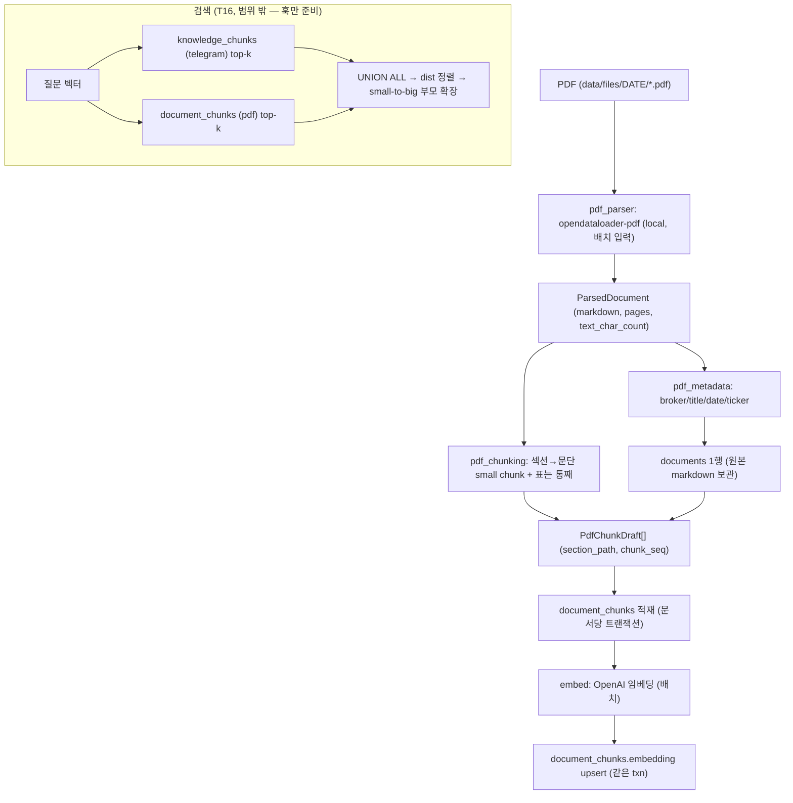

# Design: Stock Report Engine V2 — PDF Ingest (RAG 준비)

**작성일**: 2026-06-04
**상태**: DRAFT
**대상**: `jarvis report ingest-pdf` (Stock Report Engine V2 Phase 2 PDF 경로)
**관련 계획**: `docs/superpowers/plans/2026-05-08-stock-report-engine-v2.md` (T12~T15, T18)
**상위 설계서**: `docs/superpowers/specs/2026-05-08-stock-report-engine-v2-design.md`
**Supersedes**: 없음 (상위 설계서의 일부 결정을 정정 — "기존 문서 정정" 참고)

---

## Problem Statement

증권사 PDF 리포트를 `opendataloader-pdf`로 파싱해 **Markdown으로 만들고, chunk 단위로 적재해 RAG(semantic retrieval) 대상으로 만든다.**

현재 상태:
- Phase 1(Telegram-first)은 완료. `knowledge_chunks`에 `source_type='telegram_unit_v2'` 청크가 쌓이고, `build_embed_payload()`가 임베딩 텍스트의 단일 계약이다.
- 아직 없는 것: `pdf_*` 모듈, `embed` 모듈, `documents`/`document_chunks` 테이블, pgvector 확장.

이 문서는 **PDF → Markdown → small chunk → 임베딩 → pgvector upsert** 까지의 write path를 설계한다. 검색(hybrid retrieval, small-to-big merge, cross-link)은 T11/T16의 별도 작업이며, 본 문서는 그 write path를 그 작업이 바로 쓸 수 있게 준비하는 데까지를 범위로 한다.

---

## 조사 결과 (실측 근거)

`data/files`의 실제 PDF 969개(1.9GB)를 직접 분석한 결과다.

| 항목 | 발견 | 의미 |
|---|---|---|
| 텍스트 레이어 | 81개 샘플 중 79개 born-digital, `pdftotext`로 한글/숫자 완벽 추출 | **OCR 거의 불필요** (~97.5% born-digital) |
| 스캔/빈텍스트 tail | 2/81 (~2.5%) 텍스트 0~22자 | 소수 문제 문서만 `low_confidence` 격리 |
| 핵심 표 | 목표주가·실적추정·계약금액 = **테두리 있는 grid** (신한 파트너십표, 하나 Financial Data표) | local 모드 추출 대상 |
| 차트 | 매출구성 pie, R&D 타임라인 = **임베디드 이미지** | local 손실. 단 투자 사실은 표·본문에 있어 RAG 손실 작음 |
| 레이아웃 | 하나 미국노트는 **2단(사이드바+본문)** | reading order 중요 → opendataloader XY-Cut++ 활용 |
| 브로커 편중 | 신한리서치 632개(65%), Hana계열 ~20% | 2개 포맷만 잡으면 ~85% 커버 |
| 페이지 | 대부분 4~9p, 일부 13~52p | 섹션 단위 청킹에 적합한 규모 |

핵심 결론: **born-digital 코퍼스이므로 무거운 hybrid 서버(OCR/SmolVLM)는 과투자.** opendataloader 채택 이유는 OCR이 아니라 **구조화된 Markdown/JSON 출력 + 2단 reading order**다.

---

## Key Decisions

### 1. 파싱 모드: local 기본, hybrid/OCR는 wrapper 인자로만 (기본 off)

- corpus 97.5%가 born-digital → local 모드 기본. ~2.5% 스캔/빈텍스트만 `low_confidence` 격리, 필요 시 그 문서만 수동 hybrid. 자동 폴백 분기는 만들지 않는다.
- wrapper가 단일 PDF가 아니라 **디렉토리/리스트 배치 입력**을 받아 JVM 콜드스타트(~1-2s/회)를 amortize한다. (969개 backfill 시 JVM 기동만 15-30분 드는 것을 방지)

### 2. 벡터 저장: pgvector (Postgres 내장), 별도 Vector DB 아님

- 단일 사용자, 연 수만 row 규모 → 별도 Vector DB는 sync/운영 부담만. (2026-05-29 결정)
- 거리 함수 cosine(`vector_cosine_ops`), 인덱스 HNSW (pgvector ≥ 0.5.0).
- 차원 1536 (`text-embedding-3-small`). `embed_model`/`embed_version` 컬럼으로 모델 버전 추적 → 재임베딩 마이그레이션 가능.

### 3. PDF 청크는 별도 `document_chunks` 테이블에 저장 (텔레그램과 분리)

- 텔레그램·뉴스는 **짧은 원자 단위**(같은 모양, 같은 classify 컬럼)라 `knowledge_chunks` 공유. PDF는 **긴 구조형 문서**(section_path/chunk_seq/표)라 별도 테이블.
- **모양 기준 2테이블** — Phase 3 뉴스가 와도 knowledge_chunks에 들어가므로 테이블은 2개로 유지.
- 효과: `document_id` 정식 FK + ON DELETE CASCADE(재적재·삭제 안전), 텔레그램 전용 컬럼 NULL sprawl 제거, `source_pk` 다형성·`message_type='report'` 해킹 불필요, **동작 중인 Phase 1 테이블을 PDF 마이그레이션이 안 건드림(위험 격리)**.
- 비용: embed/retrieval/`report_evidence`가 2개 테이블을 다룬다.

### 4. small-to-big 저장 (작은 청크 + 부모 섹션 복원)

- PDF는 **문단/불릿 단위 작은 청크**로 임베딩(검색 정밀도↑). 표는 통째로 1청크(원자).
- `section_path` + `chunk_seq`로 부모 섹션을 `(document_id, section_path)`로 복원 가능하게 저장.
- **합치는(merge) retrieval 로직은 T16**. 본 문서는 "작게 저장 + 부모 연결 정보"까지 → 나중에 전체 재임베딩을 피한다.
- 근거: prior learning `coverage-vs-content-metric` (8/10) — "chunk 수가 아니라 distinct-info recall로 측정, truncation이 내용을 잃음". small-to-big가 정밀도+내용보존을 동시에 해결.

### 5. embed_payload는 기존 `build_embed_payload()`를 재사용 (벡터 공간 통일)

- 텔레그램과 PDF가 **같은 임베딩 모델 + 같은 payload 형식**을 쓰면 두 테이블의 벡터가 같은 좌표계에 있어 cosine 거리 비교가 유효하다 → UNION ALL 검색이 성립.
- `build_embed_payload`는 keyword-only이므로 키워드 호출. PDF는 `channel_name=브로커명`.

### 6. 파서 결과는 내부 `ParsedDocument`로 정규화 (결합도 차단)

- opendataloader 출력이 바뀌어도 wrapper 내부에서 흡수. 나머지는 `ParsedDocument`/`DocumentMeta`/`PdfChunkDraft`만 본다.

### 7. 운영 견고성 (Codex outside-voice 반영)

- **버저닝(#3)**: `documents.content_hash`로 같은 경로 내용 변경 감지, `parser_version`으로 파서 교체 추적. 둘 중 하나라도 바뀌면 재파스/재청킹/재임베드. 안 그러면 stale 벡터를 조용히 서빙.
- **임베딩 비동기(#4)**: 텍스트/청크를 먼저 커밋(`embed_status='pending'`), OpenAI 임베딩은 별도 패스에서 status+retry로 채운다. **외부 API를 DB 트랜잭션 안에 넣지 않는다.** 검색은 `embed_status='done'`만. 이 경로가 T11 backfill도 그대로 재사용.
- **needs_ocr 복구 레인(#5)**: 스캔/빈텍스트는 `parse_status='needs_ocr'`로 1급 격리(조용한 사각지대 금지). 스캔본은 하필 표 많은 문서라 별도 재실행 레인으로 hybrid+OCR 적용 가능하게 한다.

---

## 기존 문서 정정

| 위치 | 기존 | 정정 |
|---|---|---|
| 상위 설계서 §"Key Decisions 2", §Phase 2 | "Postgres + 별도 Vector DB" | **pgvector(Postgres 내장)** |
| 상위 설계서 §Phase 2 | "텔레그램과 PDF는 같은 knowledge_chunks 공유" | **PDF는 별도 `document_chunks`** (모양 기준 2테이블). 같은 임베딩 모델/payload로 벡터 공간만 공유 |
| 계획서 파일 구조 | `migrations/stock_report/002_phase2.sql` | 실제 다음 번호는 **`008`/`009`** (002~007은 phase1에서 사용됨) |
| 계획서 T13 | `pdf_ingest.py`에 wrapper 포함 | SRP로 **`pdf_parser.py`(wrapper) / `pdf_ingest.py`(오케스트레이션)** 분리 |

> 승인 후 상위 설계서의 해당 문구 정정을 후속 작업으로 권장(코드 변경 아님).

---

## Architecture



### 모듈 레이아웃 (신규/수정)

```text
src/pipelines/stock_report/
  pdf_parser.py     # [신규] opendataloader-pdf wrapper(배치 입력) -> ParsedDocument (Java runtime guard)
  pdf_metadata.py   # [신규] 파일명/폴더/1페이지 헤딩 -> DocumentMeta (A: 규칙, B: LLM)
  pdf_chunking.py   # [신규] markdown -> 문단 small chunk(+표 원자) -> PdfChunkDraft[] (section_path, chunk_seq, embed_payload)
  embed.py          # [신규] OpenAI 임베딩 + pgvector upsert (knowledge_chunks/document_chunks 공용, 테이블명 파라미터)
  pdf_ingest.py     # [신규] 오케스트레이션 run_ingest_pdf(date, input_dir, ...)
  db.py             # [수정] upsert_document / persist_document_chunks / (document 재적재) / upsert_embeddings
  config.py         # [수정] embedding 모델/차원, 청킹 파라미터(max/min chars, overlap)

migrations/stock_report/
  008_phase2_pgvector.sql    # [신규] CREATE EXTENSION vector (공유 인프라)
  009_phase2_documents.sql   # [신규] documents + document_chunks(+embedding+HNSW) + report_evidence.document_chunk_id

config/
  stock_report_pdf_sources.yaml   # [신규] 브로커 prefix -> 정식 브로커명/trust_tier

src/cli/main.py     # [수정] @report_app.command("ingest-pdf")

tests/pipelines/stock_report/
  test_pdf_parser.py     # [신규] Java 가드(unit) + 실제 파싱(@integration)
  test_pdf_metadata.py   # [신규] broker/ticker/date/low_confidence 규칙
  test_pdf_chunking.py   # [신규] 표 원자성 + 부모 복원 + small chunk (핵심)
  test_embed.py          # [신규] 차원 가드 + 배치 + table 화이트리스트 (OpenAI mock)
  test_pdf_ingest.py     # [신규] 멱등성 + 문서단위 트랜잭션(A3) + low_confidence
  test_db.py             # [수정] document upsert/persist/재적재 SQL 단언 추가
  test_migrations.py     # [수정] 008/009 + report_evidence ADD COLUMN(회귀) 텍스트 단언
  fixtures/pdf/README.md # [신규] T18 검증 세트
```

---

## Scope

| 포함 (이 문서) | 제외 (별도 작업) |
|---|---|
| T12 `report ingest-pdf` CLI | T11 Telegram chunk → knowledge_chunks 임베딩 backfill (embed 모듈은 공유, knowledge_chunks.embedding 컬럼은 T11 마이그레이션) |
| T13 파서 wrapper → `ParsedDocument` | T16 retrieval: UNION ALL + small-to-big 부모 merge + cross-link |
| T14 메타데이터 추출 + `documents` | T17 synthesis가 PDF evidence 반영 |
| T15 small chunk + 임베딩 + pgvector upsert (`document_chunks`) | |
| pgvector 확장(008) + documents/document_chunks(009) | |

---

## Schema

### `008_phase2_pgvector.sql` (공유 인프라)

```sql
CREATE EXTENSION IF NOT EXISTS vector;
```

> 마이그레이션 러너는 checksum guard로 **적용된 파일 수정 금지, 신규 추가만** 허용. 차원/모델 변경은 기존 파일 편집이 아니라 **새 마이그레이션**으로. (knowledge_chunks.embedding 컬럼은 T11에서 별도 추가)

### `009_phase2_documents.sql`

```sql
CREATE TABLE IF NOT EXISTS documents (
    id BIGSERIAL PRIMARY KEY,
    source_path TEXT NOT NULL UNIQUE,
    content_hash TEXT,
    broker_key TEXT,
    broker_name TEXT,
    title TEXT,
    published_date DATE,
    target_ticker TEXT,
    category_key TEXT,
    main_theme TEXT,
    page_count INTEGER,
    parse_mode TEXT NOT NULL DEFAULT 'local',     -- local | hybrid
    parser_version TEXT,                           -- 파서 버전 (재파스 정책, Codex #3)
    parse_status TEXT NOT NULL DEFAULT 'ok',       -- ok | low_confidence | needs_ocr | failed (Codex #5)
    text_char_count INTEGER,
    markdown TEXT,                                  -- 전문 보관 → 재청킹 시 재파싱 불필요
    parse_warnings JSONB NOT NULL DEFAULT '[]'::jsonb,
    created_at TIMESTAMPTZ NOT NULL DEFAULT NOW(),
    updated_at TIMESTAMPTZ NOT NULL DEFAULT NOW()
);
CREATE INDEX IF NOT EXISTS idx_documents_published_date ON documents (published_date);
CREATE INDEX IF NOT EXISTS idx_documents_target_ticker ON documents (target_ticker);
CREATE INDEX IF NOT EXISTS idx_documents_parse_status ON documents (parse_status);

CREATE TABLE IF NOT EXISTS document_chunks (
    id BIGSERIAL PRIMARY KEY,
    document_id BIGINT NOT NULL REFERENCES documents(id) ON DELETE CASCADE,  -- A1 해소: 정식 FK + cascade
    source_date DATE NOT NULL,
    broker_key TEXT,
    section_path TEXT NOT NULL,        -- small-to-big 부모 키
    chunk_seq INTEGER NOT NULL,        -- 문서 내 순서 (부모 복원/이웃 윈도우용)
    is_table BOOLEAN NOT NULL DEFAULT FALSE,
    category_key TEXT,
    main_theme TEXT,
    ticker_tags JSONB NOT NULL DEFAULT '[]'::jsonb,
    canonical_summary TEXT NOT NULL,
    content_clean TEXT NOT NULL,
    embed_payload TEXT NOT NULL,
    embedding vector(1536),                        -- 비동기로 채움(처음 NULL, Codex #4)
    embed_model TEXT,
    embed_version TEXT,
    embed_status TEXT NOT NULL DEFAULT 'pending',   -- pending | done | failed
    embed_attempts INTEGER NOT NULL DEFAULT 0,
    priority_score DOUBLE PRECISION NOT NULL DEFAULT 1.0,
    created_at TIMESTAMPTZ NOT NULL DEFAULT NOW(),
    UNIQUE (document_id, section_path, chunk_seq)
);
CREATE INDEX IF NOT EXISTS idx_document_chunks_document ON document_chunks (document_id);
CREATE INDEX IF NOT EXISTS idx_document_chunks_ticker ON document_chunks USING GIN (ticker_tags);
CREATE INDEX IF NOT EXISTS idx_document_chunks_section ON document_chunks (document_id, section_path, chunk_seq);
CREATE INDEX IF NOT EXISTS idx_document_chunks_embedding ON document_chunks USING hnsw (embedding vector_cosine_ops);
CREATE INDEX IF NOT EXISTS idx_document_chunks_embed_status ON document_chunks (embed_status);  -- 패스2 pending 조회

-- PDF evidence도 추적 가능하게 (knowledge_chunk_id와 둘 중 하나)
ALTER TABLE IF EXISTS report_evidence
    ADD COLUMN IF NOT EXISTS document_chunk_id BIGINT REFERENCES document_chunks(id) ON DELETE SET NULL;
```

### `document_chunks` 행 계약 (small-to-big)

한미약품 신한 리포트의 "비만 신약 파이프라인 국내 1위" 섹션 예시:

```
id   document_id  section_path                    chunk_seq  is_table  ticker_tags  canonical_summary             content_clean        embedding
53a  1            "비만 신약 파이프라인 국내 1위"   10         f         ["128940"]   한미약품 비만 파이프라인 1위  "대사질환 1위…"      [..]
53b  1            "비만 신약 파이프라인 국내 1위"   11         f         ["128940"]   한미약품 HM17321 L/O 기대     "ADA 발표 예정…"     [..]
54   1            "글로벌 파트너십 현황"            20         t         ["128940"]   한미약품 글로벌 파트너십 표   "| 파트너사 |…"      [..]
```

- 부모 복원: `WHERE document_id=1 AND section_path='비만…' ORDER BY chunk_seq` → 섹션 전체.
- `is_table=true` 청크는 분할하지 않는다(표 원자성).
- `canonical_summary`(NOT NULL): A-level은 섹션 제목(+첫 문장). B-level은 LLM 요약.
- `embed_payload`: `build_embed_payload(channel_name=브로커, category_key, main_theme, ticker_tags, canonical_summary, clean_text=small chunk)` — 텔레그램과 동일 형식 → 동일 벡터 공간.

---

## 컴포넌트 상세

### pdf_parser.py (T13)

```python
@dataclass(slots=True)
class ParsedDocument:
    source_path: str
    markdown: str
    page_count: int
    text_char_count: int
    parse_mode: str            # "local" | "hybrid"
    json_blocks: list | None   # A=None, B에서 사용
    warnings: list[str]

def parse_pdfs(
    paths: list[str],          # 배치 입력으로 JVM 콜드스타트 amortize
    *,
    use_hybrid: bool = False,
    ocr_lang: str | None = None,
    want_json: bool = False,
) -> list[ParsedDocument]: ...
```

- 내부에서 `opendataloader_pdf.convert(input_path=paths, output_dir=<tmp>, format="markdown")` 후 산출물 읽어 정규화, tmp 정리.
- **Java 런타임 가드**: `db.py`의 `_load_psycopg()` 패턴처럼 Java 11+/패키지 미설치 시 한국어 예외.

### pdf_metadata.py (T14)

```python
@dataclass(slots=True)
class DocumentMeta:
    broker_key: str | None
    broker_name: str | None
    title: str | None
    published_date: date | None
    target_ticker: str | None
    category_key: str | None
    main_theme: str | None
    parse_status: str          # ok | low_confidence | failed

def extract_metadata(parsed: ParsedDocument, source_path: str) -> DocumentMeta: ...
```

- A(MVP): broker=파일명 prefix→`config/stock_report_pdf_sources.yaml`, date=경로 날짜 폴더, title/ticker=첫 헤딩 정규식(`종목명 (123456)` / `TICKER.US`), `text_char_count < 임계(예 200)` → `low_confidence`.
- B(이후): 1페이지 헤더 LLM structured output(목표주가 포함).

### pdf_chunking.py (T15, small-to-big)

```python
@dataclass(slots=True)
class PdfChunkDraft:
    section_path: str
    chunk_seq: int
    is_table: bool
    canonical_summary: str
    content_clean: str
    embed_payload: str         # build_embed_payload(...) keyword-only 호출로 이 단계에서 생성
    ticker_tags: list[str]

def build_pdf_chunks(parsed: ParsedDocument, meta: DocumentMeta) -> list[PdfChunkDraft]: ...
```

규칙:
1. markdown을 `#`/`##` 헤딩으로 섹션 분할 → `section_path` 생성.
2. 각 섹션을 **문단(`\n\n`)/불릿 단위 작은 청크**로 분할. `max_chars` 초과 시 추가 분할(+overlap ~10%), `min_chars` 미만은 인접 병합.
3. **markdown 표 블록(`|` 연속 줄)은 분할 금지** → `is_table=true` 1청크.
4. `chunk_seq`는 문서 전체 순서(부모 복원/이웃 윈도우용).
5. `canonical_summary`=섹션 제목(+첫 문장), `embed_payload`=이 단계에서 생성.

### embed.py (knowledge_chunks/document_chunks 공용)

```python
def embed_payloads(payloads: list[str], *, model: str, version: str) -> list[list[float]]: ...
def upsert_embeddings(conn, table: str, rows: list[tuple[int, list[float]]], *, model: str, version: str) -> None: ...
```

- OpenAI 임베딩(기존 `langchain-openai`), 기본 `text-embedding-3-small`(1536). **배치 건수 상한** + 청크는 ~1500자라 입력 토큰 상한 안전.
- `table` 파라미터로 두 테이블 공용(T11 telegram backfill도 동일 함수).
- **차원 가드**: config의 모델 차원과 대상 컬럼 `vector(N)` 차원이 다르면 적재 전 명확히 실패(예: config가 3072인데 컬럼이 1536).

### pdf_ingest.py (오케스트레이션)

```python
@dataclass(slots=True)
class IngestSummary:
    total_pdfs: int
    documents_upserted: int
    chunks_inserted: int
    embedded: int
    low_confidence: int
    failed: int

def run_ingest_pdf(
    date: str,
    input_dir: str | None = None,   # 기본 data/files/{date}
    *,
    use_hybrid: bool = False,
    ocr_lang: str | None = None,
    reembed: bool = False,
) -> IngestSummary: ...
```

- 먼저 `apply_migrations(conn, Path("migrations/stock_report"))`로 스키마 보장(`run_daily_v2`와 동일 패턴).
- **2-패스 (Codex #4 — 외부 API를 트랜잭션 밖으로)**:
  - **패스 1 (텍스트)**: PDF 배치 탐색 → `parse_pdfs` → 문서별 `extract_metadata` → `upsert_document` → `build_pdf_chunks` → 청크 적재(`embed_status='pending'`, embedding NULL) 커밋. `low_confidence`/`needs_ocr`/`failed`는 청킹 건너뛰고 `documents`만.
  - **패스 2 (임베딩)**: `embed_status='pending'` 청크를 배치로 `embed_payloads` → `upsert_embeddings`(status='done'). 실패분은 `embed_attempts++` + status='failed', 재실행 시 재시도. **트랜잭션 안에 OpenAI 호출 없음.**
- 검색(T16)은 `embed_status='done'`만 본다. `--embed-missing`/재실행이 pending/failed를 채운다(T11 backfill과 동일 경로).

### 검색 훅 (T16, 범위 밖)

```sql
(SELECT id, 'telegram' src, canonical_summary, content_clean, embedding <=> %(q)s AS dist
   FROM knowledge_chunks WHERE embedding IS NOT NULL ORDER BY embedding <=> %(q)s LIMIT 20)
UNION ALL
(SELECT id, 'pdf' src, canonical_summary, content_clean, embedding <=> %(q)s AS dist
   FROM document_chunks WHERE embedding IS NOT NULL ORDER BY embedding <=> %(q)s LIMIT 20)
ORDER BY dist LIMIT 10;
-- 각 PDF hit는 (document_id, section_path) 형제를 chunk_seq로 합쳐 부모 컨텍스트로 확장(small-to-big)
```

### CLI (T12)

```bash
uv run jarvis report ingest-pdf 2026-06-02
uv run jarvis report ingest-pdf 2026-06-02 --input-dir data/files/2026-06-02
uv run jarvis report ingest-pdf 2026-06-02 --embed-missing            # 패스2만: pending/failed 임베딩 재시도
uv run jarvis report ingest-pdf 2026-06-02 --retry-ocr --ocr-lang ko  # needs_ocr 문서만 hybrid 재처리
```

---

## 멱등성 / 재적재

- `documents.source_path` UNIQUE → 재실행 시 문서 upsert.
- **변경 감지 (Codex #3)**: 적재 전 `content_hash`(파일 내용) + `parser_version` 비교. 둘 다 같고 청크가 `embed_status='done'`이면 skip. `content_hash` 변경 → 재파스+재청킹, `parser_version` 변경 → 재파스, 임베딩 모델 변경 → 재임베드. (안 그러면 stale 벡터를 조용히 서빙)
- 재적재: `ON DELETE CASCADE`로 이전 `document_chunks` 자동 정리(또는 document_id 기준 명시 삭제 후 재삽입). 고아 청크/임베딩 없음.
- `--embed-missing`: pending/failed 임베딩만 채움. `--reembed`: 청크 유지, 임베딩 전체 재생성(모델 교체 시).

---

## 테스트 계획 (단위·회귀)

컨벤션 일치: 순수 함수=합성 입력 unit, db=`FakeConnection` SQL 단언, 마이그레이션=`.sql` 텍스트 단언, 외부(Java/OpenAI)=`@pytest.mark.integration`(기본 실행 제외). 구현은 코드와 테스트를 함께 작성한다(테스트 후행 금지).

| 대상 | 필수 테스트 | 유형 |
|---|---|---|
| pdf_chunking ★ | 표 원자성(is_table 1청크, 분할 금지), 부모 복원(section_path+chunk_seq), max/min/overlap, embed_payload 형식 | unit |
| pdf_metadata | broker/ticker(128940·HPE.US)/date, low_confidence 임계, 매핑 없음 None | unit |
| embed ★ | 차원 가드(config dim≠컬럼), 배치 상한, table 화이트리스트 | unit(mock) |
| db | document upsert/INSERT 계약, 재적재 청크 중복 0(멱등) | unit(fake) |
| pdf_ingest ★ | 문서 단위 트랜잭션 롤백(A3), low_confidence/failed 경로, IngestSummary | unit(fake) |
| pdf_parser | Java 미설치 예외 / 실제 파싱 | unit + @integration |
| migrations | 008 EXTENSION, 009 FK CASCADE+HNSW+UNIQUE | unit(text) |

**REGRESSION (필수):**
1. **009의 `report_evidence` ALTER** — 기존 `test_persist_report_artifact` 통과 유지 + ADD COLUMN이 nullable/additive인지 텍스트 단언 (Phase 1 리포트 저장 안 깨짐).
2. **Phase 1 격리** — PDF 적재 후 `daily-v2` 출력 불변 가드 (별도 테이블이라 구조적이나 명시).

EVAL: A-level은 LLM 미사용 → 불필요. B-level(LLM 메타 추출) 도입 시 broker/ticker/목표주가 정확도 eval 추가.

> Test plan 아티팩트: `~/.gstack/projects/ecstatic-bardeen-e4bd44/user-feature-stock-report-v2-phase2-pdf-ingest-eng-review-test-plan-20260604-183251.md` (`/qa` 입력용)

## Validation Plan (스파이크 → T18)

- **스파이크(스키마 잠금 전, Codex #1)**: 30-50개 PDF로 표 충실도·2단 reading order·`parse_status` 분포·표 셀 추출 필요성(#2)을 먼저 실측 → 청크 스키마 확정.
- fixture: 브로커별 대표 PDF(신한 단일종목/산업, 하나 미국노트 2단, kwusa, jeilstock) + 스캔/빈텍스트 tail 1~2개.
- 검증: ① 표(목표주가·추정)가 markdown에서 안 깨지는가 ② 2단 reading order ③ `parse_status='ok'` 비율(≥95%) ④ 문단 small chunk가 의미 단위로 끊기는가 ⑤ 부모 복원(section_path+chunk_seq)이 섹션을 정확히 재구성하는가.
- 결과에 따라 3단계(JSON 정밀/hybrid 선별) 결정.

---

## 운영 / 배포

- **Java 11+ 런타임 의존성**: opendataloader는 JVM 필요. 로컬·Docker(`.docker/`)에 Java 설치. wrapper 부재 시 명확히 실패.
- **pgvector ≥ 0.5.0**(HNSW). 서버 확장 버전 확인.
- `pyproject.toml`에 `opendataloader-pdf` 추가. 벡터 클라이언트는 `psycopg`로 충분.
- 임베딩 비용: 969문서 × small chunk ~20개 ≈ 2만 청크 × `text-embedding-3-small` 1회 backfill 수 센트. 무시 가능.

---

## Cross-Model Perspective (Codex outside-voice)

독립 검증(Codex, read-only)이 6개 지적. 반영 결정:
- **#1 스파이크 선행** → 반영 (Key Decision 7, Validation Plan).
- **#3 버저닝**(content_hash + parser_version) → 반영 (스키마, 멱등성).
- **#4 임베딩 비동기**(트랜잭션 밖) → 반영 (2-패스 ingest, embed_status). 당초 A3 기본값 대체.
- **#5 needs_ocr 레인** → 반영 (parse_status='needs_ocr' + `--retry-ocr`).
- **#2 표 셀 추출** → 스파이크에서 판정 (Open Questions).
- **#6 단일 테이블 권고** → **미수용**(사용자 결정 유지): small-to-big 컬럼 발산 + Phase 1 격리 + A1 제거가 별도 테이블을 정당화. 동일 트레이드오프를 명시적으로 저울질함.

---

## Premises (확인 필요)

1. 파싱 모드 local 기본, hybrid/OCR 수동 인자 — **동의?**
2. 벡터 pgvector(`document_chunks.embedding`, HNSW, 1536) — **동의?**
3. **PDF는 별도 `document_chunks` 테이블**(텔레그램 knowledge_chunks와 분리, 벡터 공간만 공유) — **동의?**
4. **small-to-big 저장**(문단 small chunk + section_path/chunk_seq, 표 원자, merge는 T16) — **동의?**
5. 접근 C — **충실도 스파이크(스키마 잠금 전) → MVP → T18 → 선별 정밀화** (Codex #1) — **동의?**
6. 임베딩 `text-embedding-3-small`(1536) + **2-패스 비동기 임베딩**(Codex #4) — **동의?**

---

## Open Questions / 보류 항목

- **[A3] 임베딩 부분 실패**: Codex #4 반영 → **2-패스(텍스트 커밋 후 임베딩 status+retry)**, 외부 API를 DB 트랜잭션 밖으로. (당초 "문서 단위 tx" 기본값에서 변경)
- **[Codex #2] 표 표현**: "표=markdown 1청크"로 충분한지 vs 알려진 표 유형(목표주가/추정)은 셀 key-value 추출이 필요한지 → 스파이크에서 판정.
- **표 충실도(최대 리스크)**: opendataloader가 한국어 bordered 표를 markdown으로 얼마나 보존하는지 실측 전 미검증 → 스파이크/T18에서 확정.
- small chunk `max_chars`/`min_chars`/overlap 적정값(검증 후 튜닝).
- 동일 종목 다중 브로커 중복/상충은 retrieval(T16) 소관.

---

## Success Criteria

- `jarvis report ingest-pdf DATE`로 PDF가 `documents` + `document_chunks`에 멱등 적재된다.
- PDF 청크가 pgvector로 임베딩되어 semantic search 대상이 된다(검색은 T16).
- `document_chunks`는 small chunk + `section_path`/`chunk_seq`로 부모 섹션 복원이 가능하다.
- `low_confidence`/`failed` 문서가 구분 기록된다.
- Phase 1 `daily-v2`가 별도 테이블이라 **영향 없음**(격리 확인).

---

## Next Steps (구현 순서)

0. **충실도 스파이크 (스키마 잠금 전, Codex #1)**: `pdf_parser.py`(배치+Java 가드)로 30-50개 PDF → markdown·표·2단 reading order 실측. 청크 스키마 + 셀추출 여부(#2) 확정.
1. `008`(extension)/`009`(documents+document_chunks; parser_version/embed_status/needs_ocr 포함) + `config/stock_report_pdf_sources.yaml`
2. `pdf_metadata.py` + `pdf_chunking.py`(small-to-big) + 단위 테스트
3. `embed.py`(차원 가드) + `db.py` 적재 함수
4. `pdf_ingest.py` **2-패스(텍스트 커밋 → 임베딩 status+retry)** + `report ingest-pdf` CLI(`--embed-missing`/`--retry-ocr`) + 멱등성/격리/부분실패 테스트
5. **T18 fixture로 표/2단/parse_status/부모복원 회귀 고정 → 3단계 정밀화 여부 결정**

---

## 구현 품질 게이트 (사람이 보는 멈춤 지점)

자동 테스트(표 원자성·부모 복원·멱등·격리)는 빌드 내내 도는 안전망이다. 아래 4개는 **테스트로 못 잡고 사람 눈으로만 판단되는** 멈춤 지점이다. CP1은 go/no-go 게이트, CP2~4는 "스케일 키우기 전에 눈으로 확인".

```
[0]스파이크 ─🛑CP1─▶ [1]마이그레이션 ─▶ [2]청킹 ─🛑CP2─▶ [3]임베딩 ─🛑CP3─▶ [4]ingest ─🛑CP4─▶ 전체 backfill
   30-50개   (go/no-go)                       실제청크5개      소량~10문서   검색스모크         하루치             969개
```

| 게이트 | 시점 | 무엇을 본다 | 통과 기준 | 불합격 시 |
|---|---|---|---|---|
| **CP1** (go/no-go) | 스파이크(Step 0) 직후 | 실제 markdown 출력: 핵심 표(목표주가·계약금액) 숫자 보존, 하나 2단 reading order, parse_status 분포 | parse ok ≥ ~90%, 표 읽힘, 2단 안 섞임 | 표 셀 key-value 추출(#2)/브로커별 hybrid/파서 재검토 |
| **CP2** | 청킹(Step 2) 직후, 리포트 5개 | 조각이 의미 단위인가, 문장 중간 안 잘림, 표 1청크 유지, `(section_path,chunk_seq)` 부모 복원 정확 | 조각 의미 단위 + 부모 복원 정확 | max/min/overlap 튜닝, 분할 규칙 수정 |
| **CP3** | 임베딩 소량(~10문서) 직후 | 실제 질의 top-k: "한미약품 목표주가"가 맞는 청크 상위인가, small-to-big 부모 확장 맥락, 텔레그램+PDF UNION ALL 혼합 | 알려진 질문에 정답 청크 상위 | payload 형식/청킹/모델 재점검 (969 backfill 전) |
| **CP4** | 전체 backfill 직전, 하루치 | parse_status 분포(needs_ocr 격리 동작), 멱등 재실행 중복 0, 비용·시간 | 분포 안정 + 멱등 + 운영 부담 수용 | 격리/멱등 버그 수정 후 재시도 |

핵심: **CP1이 합격선** — 표 충실도(이 기능의 최대 리스크)가 여기서 갈린다. 통과 못 하면 markdown-only 접근을 바꾼다. CP2~4는 969개로 스케일 키우기 전에 출력 품질을 사람이 확인하는 지점.

### CP1 결과 (2026-06-04 스파이크 38개, 구현+독립 판단 에이전트)

- 실행: `pdf_parser.parse_pdfs`(opendataloader 2.4.7, local) → 38개. parse ok 37/38(97.4%, 1건 0바이트 깨진 파일). **배치 호출이 per-file 대비 ~2.4x 빠름**(JVM 1회 기동) → Key Decision 1 검증.
- 양호: 한글(mojibake 0), 헤딩 계층, 2단 reading order(xycut 기본), **단순 grid 표**(하나/kwusa/kiwoom 재무표 숫자·라벨 정확).
- **판정: CONDITIONAL.** 스키마 잠금 전 보완 2건:
  1. **[Blocking] needs_ocr 탐지기 수정**: `text_char_count`가 `` 마크업을 포함해, 이미지/스캔 문서(jeilstock_44199: 실제 64자, pdftotext로도 22자 → 진짜 이미지 문서)가 `'ok'`로 샘. → **이미지 마크업 제거 후 실제 텍스트 + image_ref/실텍스트 비율**로 판정해야 함. (차트 많은 텍스트-정상 리포트는 통과, 진짜 빈 것만 needs_ocr)
  2. **[Scope] 알려진 표 셀 추출 필요(Codex #2 승격)**: shinhan 다행 라벨 표(목표주가·실적추정)가 markdown 그리드에서 라벨↔숫자 결합 붕괴(현대위아 매출/영업이익/순이익 3행→1셀). 단순 표는 markdown 유지, **목표주가/실적추정 등 알려진 표 유형만 셀 key-value 추출**.
  3. [Minor] 빈 `| | |` 스켈레톤·차트축 라인 post-process 제거(junk chunk 방지).
- **API 사실(스키마/구현에 반영)**: ① `convert` 배치는 **all-or-nothing** — 깨진 1건이 배치 전체 출력을 0으로 만듦 → `parse_pdfs`는 0바이트 사전검증 + per-file 폴백 필요. ② page_count는 markdown에 없음 → json에서 읽음. ③ **`ocr_lang` 파라미터 없음** — OCR은 hybrid 백엔드(`hancom-ai`, 서버 필요)로만 → `--retry-ocr` 레인은 hybrid 서버 전제. ④ `reading_order="xycut"` 기본.

#### CP1 후속 — 복잡 표 스파이크 (JSON 가설 검증, 신한 단일종목 5개)

- **결과: 표 붕괴는 렌더링이 아니라 opendataloader table-detection 엔진 단계에서 발생.** markdown이 뭉갠 요약표(실적추정/목표주가)가 **JSON에도 동일하게 깨져** 있음(예: 현대위아 50006 — `매출액/영업이익/순이익` 3행이 한 셀로, 값 `2,061.8 4.6 48.5 2.2 95.7 (56.0)` 융합). → **local 모드(markdown·JSON 공통)로는 최고가치 요약표를 못 살린다.**
- 패턴: **줄 간격이 빽빽한 요약표 → 행 병합(LOST)**, **줄 간격 넓은 분기 상세표 → 정상(JSON에서 깔끔, markdown보다 우수)**. 즉 fidelity는 보고서 품질이 아니라 표 레이아웃 밀도에 좌우.
- 수확: JSON 표 스키마 확인됨 — `kids[] → {type:"table", rows:[{cells:[{kids:[{type:"paragraph",content}]}]}]}`. `parse_pdfs(want_json=True)`의 `json_blocks`에서 `type=="table"` 필터로 추출(분기 상세표엔 유효, ~40줄 파서).
- **Key Decision 1 갱신 필요**: "local 충분"은 산문·헤딩·단순/분기표엔 맞지만 **요약 실적추정·목표주가 표엔 불충분**. 다음 단계로 표 추출 경로 결정 필요(아래 Open Questions).
- **검증 1 — `table_method="cluster"` (로컬, 무료)**: 실패. default와 동일하게 융합. 로컬은 어떤 table_method로도 빽빽한 요약표를 못 나눔.
- **검증 2 — hybrid(docling) 50006·50005: PASS.** docling 백엔드(로컬 FastAPI, API 키 불필요)가 융합을 해소 — 매출액/영업이익/순이익이 **각각 별도 행 + 숫자 정상 결합**으로 복원(연간 재무제표 ~29행도 깔끔). 무음 Java fallback 없음.
  - 잔여: 가끔 두 값이 한 셀/헤더 열 중복(컬럼 정렬 흔들림). **행 단위 라벨↔숫자는 신뢰 가능**, 컬럼 정밀 정렬은 불완전 → downstream 파싱이 허용해야.
  - 비용(MPS): deps +~600MB(torch 등) + docling 모델 ~506MB, 서버 콜드스타트 ~31s, 변환 **PDF당 ~30~95s (local 4~6s 대비 ~8~16배)**. 부작용: typer 0.24→0.21 다운그레이드(transitive) → 채택 시 CLI 동작 확인 필요.
  - **표 경로 결론(권고)**: 요약표 있는 **단일종목 리포트에만 hybrid 적용**(매크로/전략은 표 없으니 local). 운영: ① hybrid extras는 **optional dependency group**으로 분리 ② 일일 배치 시작 시 docling 서버 1회 기동→배치→종료(콜드스타트 amortize) ③ `hybrid_fallback=False`(실패를 조용히 숨기지 않음) ④ 컬럼 drift 허용. ⑤ 분기 상세표는 JSON 표 파서로(local에서도 OK).

#### hybrid 라우팅 — "어떤 PDF만 hybrid?" (증상 기반, 보고서 종류 추측 X)

파일명에 종류 정보가 없으므로 사전 분류하지 않는다. **local 먼저 전부 파싱 → 증상 보이는 문서만 hybrid로 재처리** (needs_ocr와 동일한 local-first 승격 패턴). 두 승격 트리거(둘 다 → docling hybrid):
1. **표 융합 트리거(핵심)**: local 표 셀 중 **한 셀에 재무 line-item 라벨이 2개 이상** 뭉친 것이 있으면(예: 셀=`"매출액 영업이익 순이익"`) 그 문서는 융합 표가 있다는 증거 → hybrid. 판정: 셀 텍스트에 {매출액, 영업이익, 순이익, 지배주주순이익, EBITDA, EPS, BPS, ROE ...}(tunable set) 중 2개 이상 포함 여부 — 문자열 검사라 비용 ~0.
2. **sparse/image 트리거**: `text_char_count` 낮음 / `image_ref_count` 과다(needs_ocr) → hybrid+OCR.
- 효과: 매크로/전략 리포트는 융합 표가 없어 자동으로 local-only; 단일종목이라도 표가 멀쩡하면(예: 파트너십 표) hybrid 생략 → 느린 hybrid를 최소 문서에만. 티커 유무는 보조 힌트일 뿐, 방아쇠는 "융합 표 실재 여부".
- `documents`에 `needs_hybrid BOOLEAN` 플래그를 두고 2패스에서 소비.
