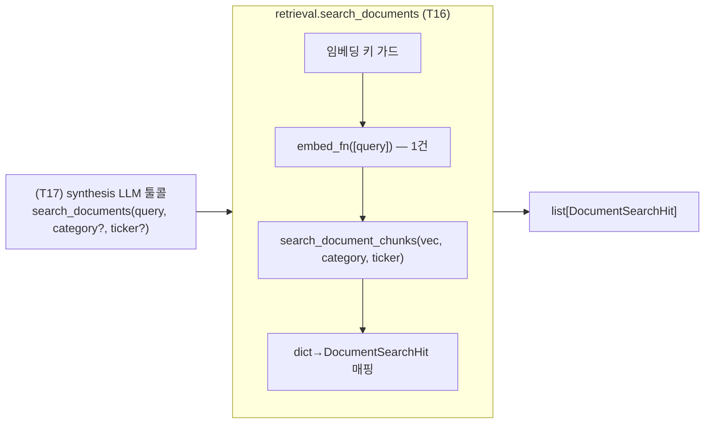

# Design: Stock Report Engine V2 — T16 PDF Semantic Search (T17 LLM-tool ready)

**작성일**: 2026-06-15
**상태**: DRAFT
**대상**: `src/pipelines/stock_report/retrieval.py` PDF 검색 함수 (Stock Report Engine V2 Phase 2 검색 경로)
**관련 계획**: `docs/superpowers/plans/2026-05-08-stock-report-engine-v2.md` (T16)
**상위 설계서**: `docs/superpowers/specs/2026-06-04-stock-report-v2-pdf-ingest-design.md` (write path)

---

## Problem Statement

증권사 PDF 장문 근거를 텔레그램 기반 일일 리포트에 끌어와야 한다(로드맵 T16의 Why: "같은 이슈가 서로 다른 소스에 흩어지면 설명력이 떨어진다").

**핵심 결정(사용자)**: 텔레그램 테마↔PDF "연결(cross-link)"은 **T17에서 synthesis LLM이 검색 툴(function calling)로 직접 수행**한다. 따라서 T16은 **그 툴이 그대로 호출할 PDF 의미검색(semantic search) 능력**까지만 만들고 마무리한다.

- T16 = **PDF 검색 함수** (텍스트 쿼리 → 임베딩 → 벡터검색 → 결과 리스트). 카테고리·티커로 필터, 문서당 1개 dedup.
- T17 = 이 함수를 LLM 툴로 노출 + synthesis를 tool-calling 루프로 확장 + 결과를 리포트/evidence에 반영. (범위 밖)

"연결"의 의미: T17의 LLM이 자기가 쓰고 있는 텔레그램 테마 맥락으로 쿼리를 만들어 PDF를 검색하는 행위 자체가 cross-link다. 결정적 pre-linking은 만들지 않는다(LLM이 안 쓰므로 낭비).

---

## 현재 상태 (실측 근거)

코드/마이그레이션 직접 확인 결과.

| 항목 | 발견 | 의미 |
|---|---|---|
| `document_chunks`(PDF) | `embedding vector(1536)` + HNSW, `search_document_chunks`(`db.py:572`)로 **per-doc dedup 벡터 검색** | PDF 벡터 검색 + source 단위 dedup 이미 구현(df63d46) |
| `search_document_chunks` 입력 | `query_vec`(이미 임베딩된 벡터)를 받음 | 텍스트→임베딩 단계가 별도로 필요(=T16이 채울 부분) |
| `embed_payloads`(`embed.py:78`) | `list[str] → list[list[float]]`, 임베딩 전용 키/URL 해석 | 쿼리 임베딩에 재사용 |
| `report_evidence.document_chunk_id` | FK 컬럼 **이미 존재**(009) | PDF evidence 인용 자리 준비됨 (T17용) |
| `knowledge_chunks`(텔레그램) | `embedding` 벡터 컬럼 **없음** (T11 미완료) | T16 범위 밖. PDF 검색만 다룸 |
| synthesis(`synthesize.py:500`) | 현재 **structured-output 단일 호출**(`LocalEvidenceSynthesisOutput`) | tool-calling 루프 개조는 T17 |

---

## Key Decisions

### 1. T16 = PDF 검색 능력만, 연결/소비는 T17 LLM 툴

- 결정적 pre-linking(테마별 사전검색, `CrossLinkedBundle`, theme/ticker 링크맵, 파이프라인 훅)은 **만들지 않는다**. T17 LLM이 툴로 직접 검색하므로 사전계산 결과를 소비하지 않는다.
- T16 산출물은 **재사용 가능한 검색 함수 하나** — T17 툴이 이 함수를 그대로 감싼다.

### 2. 쿼리는 깨끗한 텍스트 (테마명/토픽/티커), "테마+그날요약" 합성 금지

- 쿼리에 그날 텔레그램 요약을 합치면 잡음이 끼어 "왜 걸렸는지" 해석이 어렵고 precision이 떨어진다. T16 함수는 **호출자가 준 텍스트 쿼리를 그대로** 임베딩한다(쿼리 책임은 호출자=T17 LLM).
- **티커**: 임베딩 의미가 약하므로(`005930.KS`엔 의미 없음) **`ticker_tags` exact 태그 필터**로 거른다. 의미 랭킹이 필요하면 호출자가 회사/토픽 텍스트를 `query_text`로, 종목코드를 `ticker`로 함께 넘긴다.
- **테마/토픽**: `query_text` 임베딩 → 벡터검색. `category`는 정규화된 taxonomy key일 때만 필터로 쓴다(자유텍스트 provisional 값은 PDF `documents.category_key`와 안 맞음 — 무엇을 넘길지는 T17 책임).

### 3. 마이그레이션 없음 / 순수 추가(additive)

- 기존 컬럼·인덱스(`category_key`, GIN `ticker_tags`, HNSW `embedding`)만 재사용. 기존 코드 경로 회귀 0.

### 4. (정리) 이전 결정 철회 — 파이프라인 관찰 훅 제거

- 직전 설계의 "daily-v2 관찰 훅"은 결정적 linking을 전제로 했으나, T16이 검색 함수로 축소되며 **관찰할 linking 과정이 사라져 훅도 제거**한다. 검색 품질 관찰은 T17 툴콜 로그(또는 필요 시 별도 수동 CLI)로 한다. `pipeline.py`/`main.py`는 T16에서 건드리지 않는다.

---

## Architecture

레이어 분리 유지: **SQL은 `db.py`, 오케스트레이션은 `retrieval.py`.**



### 신규 함수 (`retrieval.py`)

```python
@dataclass(slots=True)
class DocumentSearchHit:
    chunk_id: int           # search_document_chunks 반환 key "id"를 매핑
    document_id: int
    doc_title: str | None
    broker_key: str | None
    published_date: date | None
    section_path: str
    is_table: bool
    content_clean: str
    category_key: str | None
    main_theme: str | None
    ticker_tags: list[str]
    similarity: float

def search_documents(
    query_text: str,
    *,
    category: str | None = None,
    ticker: str | None = None,
    top_k: int = 5,
    embed_fn: Callable[[list[str]], list[list[float]]] | None = None,
    search_fn: Callable[..., list[dict[str, Any]]] | None = None,
) -> list[DocumentSearchHit]:
    if embed_fn is None:
        from src.pipelines.stock_report.embed import embed_payloads
        embed_fn = embed_payloads
    if search_fn is None:
        from src.pipelines.stock_report.db import search_document_chunks
        search_fn = search_document_chunks
    ...
```

- `query_text`를 **단건 임베딩**(`embed_fn([query_text])[0]`) 후 `search_fn(vec, category_filter=category, ticker_filter=ticker, top_k=top_k)` 호출, 결과 dict를 `DocumentSearchHit`로 매핑(`chunk_id=row["id"]`, 나머지는 동일 키).
- `embed_fn`/`search_fn`은 `None` 기본 → **함수 내부 지연 import**(seam). 테스트는 가짜 주입으로 네트워크·DB 0.
- **순환 import 회피(필수)**: `db.py`→`synthesize`→`retrieval` 체인 때문에 `retrieval` 최상단에서 `db` import 시 순환. `search_document_chunks`는 **반드시 함수 내부 지연 import**. 이는 기존 관례(`_load_psycopg` `db.py:42`, `OpenAIEmbeddings` `embed.py:97`)와 동일.
- **임베딩 키 부재 선제 가드**: 임베딩 전용 키가 없으면(embed 모듈 인증 해석 재사용) **호출 없이 빈 리스트 반환**(daily/T17 경로가 매번 인증 실패 경고를 쏟지 않도록).

### `db.py` 변경 — `search_document_chunks`에 `ticker_filter` 추가

```python
def search_document_chunks(
    conn, query_vec, *,
    category_filter: str | None = None,
    ticker_filter: str | None = None,   # 신규
    top_k: int = 5,
) -> list[dict[str, Any]]:
```

- `ticker_filter` 지정 시 SQL에 `AND dc.ticker_tags @> %(ticker)s::jsonb`, `params["ticker"] = json.dumps([ticker_filter])` (GIN 인덱스 `idx_document_chunks_ticker` 활용).
- `category_filter`와 AND 결합. per-doc dedup CTE·기존 시그니처(kw-only) 하위호환 유지.

---

## 데이터 흐름

1. (T17) LLM이 테마 맥락으로 `search_documents("HBM 메모리 수요", category="반도체")` 같은 툴콜.
2. 키 가드 통과 → `query_text` 단건 임베딩.
3. `search_document_chunks(vec, category_filter, ticker_filter, top_k)` — 카테고리/티커 필터 + per-doc dedup 벡터검색.
4. dict → `DocumentSearchHit` 매핑해 반환. (T17이 툴 출력으로 직렬화)

---

## 에러 처리 (전부 graceful — 호출 경로를 깨지 않음)

| 상황 | 처리 |
|---|---|
| 임베딩 키 미설정 | **호출 전 감지** → 빈 리스트 + 단발 info 로그 (반복 경고 방지) |
| 임베딩/검색 호출 실패(미설치 `RuntimeError`, 차원 `ValueError`, 네트워크 등) | **`except Exception`** + `logger.warning(..., exc_info=True)`(pdf_ingest.py:320 관례) → 빈 리스트 |
| `query_text`가 빈 문자열/공백 | 임베딩 호출 없이 빈 리스트 |
| 카테고리/티커에 해당 PDF 없음 | 빈 리스트 |

---

## 테스트 계획

### `test_retrieval.py` (**기존 파일에 append — Create 아님**, 네트워크·DB 0)

⚠️ 이미 존재하는 파일(`load_same_day_chunks`/`build_same_day_bundle` 테스트 + `FakeCursor`/`FakeConnection(rows)` mock). **덮어쓰지 말고 추가**. cross-link 검색은 seam(`embed_fn`/`search_fn`)만 쓰므로 conn 불필요(가짜 `search_fn` helper로 충돌 회피).

- `embed_fn`이 `[query_text]` 단건으로 정확히 1회 호출
- `search_fn`에 `category_filter`/`ticker_filter`/`top_k` 인자 정확히 전달
- 반환 dict가 `DocumentSearchHit`로 매핑(`chunk_id=row["id"]` 포함)
- 빈/공백 `query_text` → embed_fn 미호출, 빈 리스트
- 임베딩 키 미설정 → 호출 없이 빈 리스트
- 임베딩 예외 → 빈 리스트, 예외 전파 안 함 (`except Exception` 경로)

### `test_db.py` (확장)

- `ticker_filter` 지정 시 SQL에 `@> ...::jsonb` 절 + `ticker` 파라미터 바인딩(`["TICKER"]`)
- 미지정 시 ticker 절 부재 (기존 동작 회귀 없음)
- `category_filter` + `ticker_filter` 동시 지정 시 두 절 모두 AND

---

## 범위 밖 (후속)

- **T17 (cross-link 실현)**: `search_documents`를 synthesis LLM **툴로 노출**(function schema) + structured-output → **tool-calling 루프 개조** + 텔레그램 테마 맥락 → 쿼리 생성 + 결과를 리포트/렌더에 반영 + `report_evidence.document_chunk_id` 적재 + small-to-big 부모 섹션 merge.
- **T11**: 텔레그램 임베딩 backfill → 텔레그램도 의미검색 대상.
- **(옵션) 수동 관찰 CLI**: `jarvis report search-pdf "쿼리"` — 실데이터로 검색 품질을 보려면 추가 가능(미요청 시 안 만듦).

---

## 파일 변경 목록

| 파일 | 변경 | 내용 |
|---|---|---|
| `src/pipelines/stock_report/retrieval.py` | Modify | `DocumentSearchHit` + `search_documents(query_text, ...)` (텍스트→임베딩→검색 래퍼) |
| `src/pipelines/stock_report/db.py` | Modify | `search_document_chunks`에 `ticker_filter` 추가 |
| `tests/pipelines/stock_report/test_retrieval.py` | **Modify (append)** | `search_documents` 테스트 (seam embed_fn/search_fn, 기존 테스트·mock 보존) |
| `tests/pipelines/stock_report/test_db.py` | Modify | `ticker_filter` SQL 테스트 |
| `docs/FEATURES.md` | Modify | 5-2 PDF Ingest 섹션에 PDF 의미검색(T17 tool-ready) 항목 |

`pipeline.py`/`main.py`는 **변경 없음**(T16 scope 축소 결과).

---

## 설계 변경 이력 (2026-06-15)

처음엔 "텔레그램 테마별로 PDF를 결정적으로 사전검색해 묶는 cross-linker + 파이프라인 관찰 훅"으로 설계했으나, 두 차례 피드백으로 축소·정정했다.

| 시점 | 피드백 | 변경 |
|---|---|---|
| subagent 리뷰 | `test_retrieval.py` 이미 존재 / provisional 카테고리 어휘 비대칭 / 광역 except / 키 부재 가드 / chunk_id↔id | append 정정, except/가드/매핑 반영 |
| 사용자 | "테마+요약 쿼리 대신 테마명·티커로 검색하거나 LLM 툴로 제공해야" → "T17에서 LLM 툴이 소비하는 설계면 T16은 여기서 마무리" | **cross-linker/번들/파이프라인 훅 전부 제거**, T16을 `search_documents` 검색 함수로 축소. provisional-skip 규칙은 T16에서 불필요해져 삭제(카테고리 판단은 T17 LLM 몫) |
