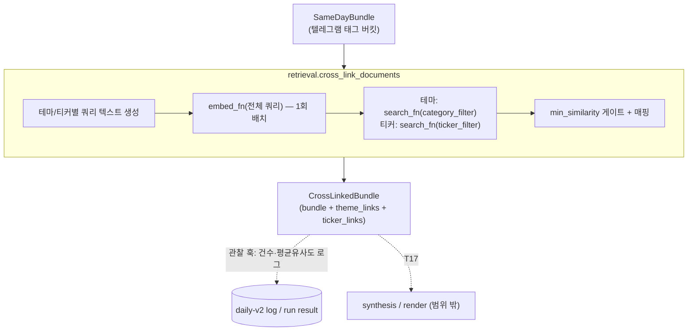

# Design: Stock Report Engine V2 — T16 Telegram-PDF Cross-Link

**작성일**: 2026-06-15
**상태**: DRAFT
**대상**: `src/pipelines/stock_report/retrieval.py` cross-linker (Stock Report Engine V2 Phase 2 검색 경로)
**관련 계획**: `docs/superpowers/plans/2026-05-08-stock-report-engine-v2.md` (T16)
**상위 설계서**: `docs/superpowers/specs/2026-06-04-stock-report-v2-pdf-ingest-design.md` (write path)

---

## Problem Statement

같은 투자 이슈가 **텔레그램 단신(short signal)** 과 **증권사 PDF 장문(long-form)** 에 흩어져 있다. 둘을 하나의 테마/티커 근거로 묶지 않으면 리포트 설명력이 떨어진다(로드맵 T16의 Why).

이 문서는 **텔레그램 테마/티커 → 관련 PDF chunk를 연결(cross-link)하는 retrieval 레이어**를 설계한다. synthesis/렌더 반영은 T17의 별도 작업이며, 본 문서는 그 연결 결과를 만들고 **관찰 가능하게(로그/run result)** 만드는 데까지를 범위로 한다.

---

## 현재 상태 (실측 근거)

코드/마이그레이션 직접 확인 결과.

| 항목 | 발견 | 의미 |
|---|---|---|
| `knowledge_chunks`(텔레그램) | `embed_payload`(텍스트)만 있고 **`embedding` 벡터 컬럼 없음** (001~009 어디에도 추가 안 됨) | 텔레그램은 **벡터 검색 불가**, 태그(category/theme/ticker) 기반만 |
| `knowledge_chunks` retrieval | `load_same_day_chunks` = 날짜 + source_type + message_type, 카테고리/테마/티커 **버킷** | 이미 exact tag로 묶여 있음 |
| `document_chunks`(PDF) | `embedding vector(1536)` + HNSW, `search_document_chunks`로 **per-doc dedup 벡터 검색** | PDF는 벡터 검색 가능, source 단위 dedup 완료(T16 bullet 2 충족) |
| `report_evidence.document_chunk_id` | FK 컬럼 **이미 존재**(009) | PDF를 근거로 인용할 자리 준비됨 (T17용) |
| T11 (텔레그램 임베딩 backfill) | **미완료** | 진짜 UNION 벡터 검색의 선행조건이나 본 T16에서 보류 |
| daily-v2 파이프라인 | `load_same_day_bundle` → `synthesize` 사이가 연결 지점 | 여기에 관찰 훅을 끼움 |

핵심 결론: 텔레그램은 벡터가 없으므로 **"exact tag(텔레그램·필터) + vector(PDF recall)"** 하이브리드가 현재 스키마에 자연스럽다. 이는 로드맵 T16 문구("exact tag와 vector similarity를 함께 사용")와 정확히 일치한다.

---

## Key Decisions

### 1. 접근 A — 카테고리/티커 필터(exact tag) + 테마 쿼리 벡터 recall

- 텔레그램 **테마**: `category_key`를 하드 필터로, "테마명 + 그날 요약"을 쿼리로 임베딩해 같은 카테고리 PDF를 벡터 검색.
- 텔레그램 **focus 티커**: `ticker_tags` 정확 매칭(GIN)으로 필터해 같은 방식 벡터 검색.
- exact tag = 필터(정밀도), vector = recall. per-doc dedup은 기존 `search_document_chunks`가 보장.
- 대안 B(티커 정확매칭 우선)·C(필터 없는 융합 스코어)는 보류. 사용자가 "결과를 보면서 텔레그램까지 차후 확장"을 선택 → 가장 단순·관찰 가능한 A로 시작.

**provisional/unclassified 카테고리 처리 (필수 — taxonomy 어휘 비대칭 방어):**
- `CategoryBucket.category_key`/`ThemeBucket.category_key`는 `display_category`로 채워지며(`retrieval.py:164,174,131`), 이는 `category_key=="unclassified"`일 때 **정규화되지 않은 자유텍스트 `provisional_category`** 또는 리터럴 `"unclassified"`로 대체된다(`retrieval.py:38-42`). PDF `documents.category_key`는 taxonomy로 **정규화된 값**(`pdf_classify.py:206-214`)이라, provisional 자유텍스트로 PDF를 필터하면 글자가 안 맞아 **그 테마 링크가 항상 0건**이 된다.
- **규칙**: 테마 레벨 카테고리 링크는 **정규화된 taxonomy key를 가진 버킷에만** 적용한다. `CategoryBucket.is_provisional == True`이거나 `category_key == "unclassified"`인 버킷은 **테마 링크에서 skip**(category_filter로 쓸 정식 key가 없으므로).
- **focus 티커 링크는 영향 없음** — `ticker_filter`는 category가 아니라 `ticker_tags`로만 거르므로, provisional/unclassified 테마라도 티커가 있으면 PDF가 걸린다. provisional 테마의 recall은 티커 경로로 일부 보존된다.

### 2. 텔레그램은 태그 기반 유지 (T11 보류)

- knowledge_chunks 임베딩(신규 마이그레이션 + 코퍼스 전체 backfill)은 비용·범위가 커서 보류.
- A는 B를 막지 않는다 — 나중에 텔레그램 벡터가 생기면 링크 키를 벡터로 확장 가능.

### 3. 마이그레이션 없음 / 순수 추가(additive)

- 기존 컬럼·인덱스(`category_key`, GIN `ticker_tags`, HNSW `embedding`)만 재사용.
- 기존 `SameDayBundle`을 **변형하지 않고** 감싸는 `CrossLinkedBundle`을 새로 만든다 → 기존 번들 빌드 코드 회귀 0.

### 4. synthesis/렌더는 안 건드림 (T17 분리), 단 관찰 훅은 넣음

- 일일 리포트 **출력(markdown)은 그대로**. 회귀 0.
- `run_daily_v2`에 cross-link 단계를 끼워 **"테마별 PDF 연결 건수 / 평균 유사도"를 로그 + run result**로 노출 → `min_similarity` 튜닝을 실데이터로 관찰.
- 외부 임베딩 호출이 daily 경로에 1회 추가되므로 `--no-cross-link`(기본 on) opt-out 제공. 임베딩 키 미설정 등 실패 시에도 graceful(빈 링크).

### 5. small-to-big 부모 섹션 merge는 T17로 이관 (기존 문서 정정)

- 상위 PDF ingest 스펙(2026-06-04)은 "부모 merge"를 T16에 묶었으나, 본 T16은 **링크(어떤 PDF가 어느 테마/티커에 걸리는지)** 에 집중한다.
- 부모 섹션 복원(`(document_id, section_path)`로 이웃 chunk 합치기)은 evidence가 **실제 synthesis 프롬프트에 들어갈 때** 필요 → T17로 이관. 관찰 단계에선 matched chunk + similarity로 충분.

---

## Architecture

레이어 분리 유지: **SQL은 `db.py`, 오케스트레이션은 `retrieval.py`** (기존 관행과 동일).



### 신규 구조 (`retrieval.py`)

```python
@dataclass(slots=True)
class LinkedDocumentChunk:
    chunk_id: int
    document_id: int
    doc_title: str | None
    broker_key: str | None
    published_date: date | None
    section_path: str
    is_table: bool
    content_clean: str
    similarity: float

@dataclass(slots=True)
class CrossLinkedBundle:
    bundle: SameDayBundle                              # 원본 그대로
    theme_links: dict[str, list[LinkedDocumentChunk]]  # theme_key → PDF
    ticker_links: dict[str, list[LinkedDocumentChunk]] # ticker  → PDF
```

### 진입점 (seam 주입으로 네트워크·DB 0 테스트)

```python
def cross_link_documents(
    conn: Any,
    bundle: SameDayBundle,
    *,
    embed_fn: Callable[[list[str]], list[list[float]]] | None = None,
    search_fn: Callable[..., list[dict[str, Any]]] | None = None,
    top_k_per_theme: int = 3,
    top_k_per_ticker: int = 3,
    min_similarity: float = 0.30,
    max_summaries_per_query: int = 5,
) -> CrossLinkedBundle:
    if embed_fn is None:
        from src.pipelines.stock_report.embed import embed_payloads
        embed_fn = embed_payloads
    if search_fn is None:
        from src.pipelines.stock_report.db import search_document_chunks
        search_fn = search_document_chunks
    ...
```

- `embed_fn`/`search_fn`은 `None` 기본 → **함수 내부 지연 import**로 실제 구현 해석. 테스트는 가짜 주입(Michael Feathers seam).
- **순환 import 회피(필수)**: `db.py`가 `synthesize.ReportEvidenceRef`를, `synthesize`가 `retrieval`을 import하므로, `retrieval.py` 최상단에서 `db`를 import하면 `retrieval → db → synthesize → retrieval` 순환이 생긴다. `search_document_chunks`는 **반드시 함수 내부에서 지연 import**한다(모듈 최상단 import 금지). 이 지연 import는 신규 예외가 아니라 기존 관례다(`_load_psycopg` `db.py:42`, `OpenAIEmbeddings` `embed.py:97`, `tiktoken` `embed.py:62`).
- **임베딩 키 부재 선제 가드(필수)**: `_resolve_embed_auth`는 키가 없어도 예외 없이 `api_key=None`으로 진행하다 OpenAI 호출에서 인증 실패한다(`embed.py:116-120`). daily-v2 **매 실행 경고**를 막기 위해 진입부에서 임베딩 키 존재를 확인하고(embed 모듈 인증 해석 재사용), **없으면 호출 없이 빈 맵 + 단발 info 로그**로 빠진다.

### `db.py` 변경 — `search_document_chunks`에 `ticker_filter` 추가

```python
def search_document_chunks(
    conn, query_vec, *,
    category_filter: str | None = None,
    ticker_filter: str | None = None,   # 신규
    top_k: int = 5,
) -> list[dict[str, Any]]:
```

- `ticker_filter` 지정 시 SQL에 `AND dc.ticker_tags @> %(ticker)s::jsonb` 추가, `params["ticker"] = json.dumps([ticker_filter])` (GIN 인덱스 `idx_document_chunks_ticker` 활용).
- category_filter와 AND 결합. per-doc dedup CTE 구조·기존 시그니처 하위호환 유지.

### 파이프라인 훅 (`pipeline.py`)

```python
@traceable(name="Stock Report Daily V2 - Cross Link Documents")
def _stage_cross_link_documents(conn, bundle):
    return cross_link_documents(conn, bundle)
```

- `run_daily_v2`의 `load_same_day_bundle` 직후 호출 → 건수/평균 유사도 로그. **synthesis는 여전히 `same_day_bundle` 사용**(출력 불변).
- **`@traceable` redaction**: 기존 final-report 스테이지처럼(`pipeline.py:133-148`의 `process_inputs` 관례) `conn`과 거대한 `bundle`을 그대로 직렬화하지 않도록 입력을 redact한다(연결 객체 trace 비용·노이즈 방지).
- `enable_cross_link: bool = True`는 `run_daily_v2` 시그니처에 추가하고 **CLI 호출부(`main.py:1379-1386`)와 `daily-v2` 옵션(`--no-cross-link`)까지 함께 배선**한다. `DailyV2RunResult`에 `cross_link_summary`(테마/티커 연결 건수) 추가(markdown 리포트엔 미반영).

---

## 데이터 흐름 / 쿼리 구성

1. **쿼리 수집**: `ThemeBucket`(카테고리 버킷 하위) + `focus_ticker_buckets` 순회.
   - **테마 버킷 skip 규칙**: `CategoryBucket.is_provisional == True`이거나 `category_key == "unclassified"`인 버킷은 **테마 링크 대상에서 제외**(정규화된 category_filter가 없어 PDF가 안 걸리거나 unclassified끼리 잡음 매칭됨). 티커 버킷은 category 무관이라 제외하지 않음.
   - 테마 쿼리: `"{theme_key}\n{상위 max_summaries개 canonical_summary를 ' / '로 연결}"`. 요약은 **비어있지 않은 것만** 모은다(`synthesize._join_summaries`의 "근거 없음" filler는 임베딩에 넣지 않음). 요약 0개면 `theme_key`만 임베딩, `theme_key`마저 비면 그 버킷 skip.
   - 티커 쿼리: `"{ticker}\n{해당 티커 청크 요약들}"` (동일 규칙).
   - 테마명만으론 신호가 빈약해 그날 앵글을 요약으로 보강(임베딩 모듈이 8000토큰 자동 절단).
2. **배치 임베딩**: 테마+티커 쿼리를 한 리스트로 `embed_fn` **1회** 호출 → 인덱스로 되매핑.
3. **검색**: 테마는 `category_filter`, 티커는 `ticker_filter`로 `search_fn` 호출(각 top_k).
4. **품질 게이트**: `similarity < min_similarity` 링크 제거 — 벡터 검색은 무관해도 top-K를 채우므로 바닥값으로 잡음 컷. `min_similarity=0.30`/`top_k=3`은 **경험적 초기 추정값**(분포 측정 전)이며, 관찰 훅 수치를 보고 튜닝할 핵심 손잡이.
5. **매핑**: `theme_links[theme_key]`, `ticker_links[ticker]` 구성. 같은 theme_key가 복수 카테고리에 나오면 link를 합치되 **같은 `document_id`는 similarity 높은 쪽만 남긴다**(max-similarity dedup).

---

## 에러 처리 (전부 graceful — daily 리포트를 절대 깨지 않음)

| 상황 | 처리 |
|---|---|
| 임베딩 키 미설정(별도 키 부재) | **호출 전 감지** → 빈 링크 맵 + 단발 info 로그 (매 실행 경고 방지) |
| 임베딩/검색 호출 실패(미설치 `RuntimeError`, 차원 `ValueError`, 네트워크/타임아웃 등) | **`except Exception` 광역 catch** + `logger.warning(..., exc_info=True)` (pdf_ingest.py:320 관례) → 빈 링크 맵 |
| 임베딩 결과 개수 ≠ 쿼리 개수 | 경고 로그 + 빈 링크 맵 |
| 특정 카테고리/티커에 PDF 없음 | 그 키 링크만 `[]` |
| 빈 번들(테마/티커 0개) | 빈 링크 맵, embed_fn 미호출 |
| `enable_cross_link=False` | 단계 skip, 빈 요약 |

---

## 테스트 계획

### `test_retrieval.py` (**기존 파일에 append — Create 아님**, 네트워크·DB 0)

⚠️ 이 파일은 이미 존재한다(`load_same_day_chunks`/`build_same_day_bundle` 테스트 6개 + `FakeCursor`/`FakeConnection(rows)` mock). **덮어쓰지 말고 cross-link 테스트를 추가**한다. cross-link 테스트는 conn을 거의 안 쓰고 seam(`embed_fn`/`search_fn`)만 쓰므로 기존 `FakeConnection` 재사용(또는 `conn=None`), 가짜 `search_fn`은 별도 helper로 둬 기존 mock 시그니처와 충돌 금지.

가짜 `embed_fn`(결정적 벡터) + 가짜 `search_fn`(카테고리/티커별 canned dict 행) 주입.

- 테마 링크가 올바른 theme_key에 매핑
- focus 티커 링크가 올바른 ticker에 매핑
- **provisional/unclassified 테마 버킷은 테마 링크에서 skip**(category_filter 미적용)
- `embed_fn`이 **정확히 1회**(배치 효율) 호출, 쿼리 텍스트에 테마명+요약 포함
- `category_filter`/`ticker_filter` 인자가 각 호출에 정확히 전달
- `similarity < min_similarity` 링크 제거
- 임베딩 예외 → 빈 맵 반환, 예외 전파 안 함 (`except Exception` 경로)
- 임베딩 키 미설정 → 호출 없이 빈 맵
- 빈 번들 → embed_fn 미호출, 빈 맵
- 같은 theme_key 복수 카테고리 → max-similarity로 document_id 재dedup

### `test_db.py` (확장)

- `ticker_filter` 지정 시 SQL에 `@> ...::jsonb` 절 + `ticker` 파라미터 바인딩(`["TICKER"]`)
- 미지정 시 ticker 절 부재 (기존 동작 회귀 없음)
- category + ticker 동시 지정 시 두 절 모두 AND

---

## 범위 밖 (후속)

- **T11**: 텔레그램 임베딩 backfill → 진짜 UNION 벡터 검색.
- **T17**: synthesis 프롬프트에 PDF excerpt 주입, small-to-big 부모 섹션 merge, render에서 source type별 표시, `report_evidence.document_chunk_id` 적재.

---

## 파일 변경 목록

| 파일 | 변경 | 내용 |
|---|---|---|
| `src/pipelines/stock_report/retrieval.py` | Modify | `LinkedDocumentChunk`/`CrossLinkedBundle`/`cross_link_documents` + 쿼리 빌더 |
| `src/pipelines/stock_report/db.py` | Modify | `search_document_chunks`에 `ticker_filter` 추가 |
| `src/pipelines/stock_report/pipeline.py` | Modify | `_stage_cross_link_documents` 훅 + 로그 + `cross_link_summary` |
| `src/cli/main.py` | Modify | `daily-v2`에 `--no-cross-link` 플래그 |
| `tests/pipelines/stock_report/test_retrieval.py` | **Modify (append)** | cross-link 테스트 추가 (기존 번들 테스트·mock 보존, 덮어쓰기 금지) |
| `tests/pipelines/stock_report/test_db.py` | Modify | `ticker_filter` SQL 테스트 |
| `docs/FEATURES.md` | Modify | 5-2 PDF Ingest 섹션에 cross-link 검색 항목 |

---

## 리뷰 반영 (2026-06-15, system-architect 서브에이전트)

설계 직후 별도 서브에이전트 리뷰에서 발견한 사항을 반영했다.

| 등급 | 발견 | 반영 |
|---|---|---|
| 🔴 Blocker | `test_retrieval.py`가 이미 존재(스펙은 "Create") | 파일 변경 목록·테스트 계획을 **Modify(append)**로 정정, mock 충돌 방지 명시 |
| 🔴 Blocker | provisional/`unclassified` 카테고리는 PDF `documents.category_key`(정규화)와 어휘 비대칭 → 필터 0건/잡음 | Key Decision 1에 **provisional/unclassified 테마 버킷 skip + 티커 경로 보존** 규칙 추가 |
| 🟡 Major | `LinkedDocumentChunk.chunk_id` ↔ search 반환 키 `id` 불일치 | `chunk_id=row["id"]` 수동 매핑 명시 |
| 🟡 Major | 임베딩 예외 타입 열거가 광역 catch 관례와 어긋남 | 에러 표를 `except Exception` + `exc_info=True`로 정정 |
| 🟡 Major | 임베딩 키 미설정 시 매 실행 경고 발생 | 진입부 **키 부재 선제 가드**(호출 전 빈 맵+info) 추가 |
| 🟢 Minor | theme_key 복수 카테고리 dedup 기준 모호 | **max-similarity dedup** 명시 |
| 🟢 Minor | 빈 요약 시 filler 임베딩 위험 | 비어있지 않은 요약만, theme_key fallback 규칙 명시 |
| 🟢 Minor | `@traceable`가 conn/bundle 직렬화 | `process_inputs` redaction 관례 적용 명시 |
| ✅ 확인 | 지연 import는 기존 관례(`_load_psycopg` 등), 순환 import 주장 정확, GIN `@>` 가능, 시그니처 하위호환 | 변경 없음 (근거 보강) |
